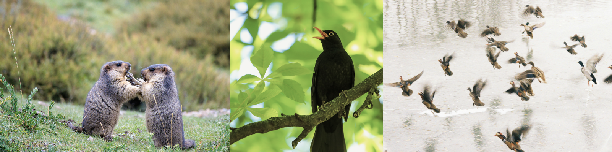

# Einführung in die Verhaltensbiologie {#Einführung}

**Wenn wir auf unserem Handy bereits zum zweiten Mal die «Snooze»-Taste gedrückt haben, bevor wir uns in Eile den Rucksack schultern und aus dem Haus rennen, um noch rechtzeitig das Tram zu erwischen, haben wir bereits zahlreiche Verhaltensmuster gezeigt. In diesem Kapitel gehen wir der Frage nach, was in der Biologie unter Verhalten verstanden wird und wie sich dieses beobachten und messen lässt.**

<br>

>**Lernziele**
>
>-	Sie können den Begriff «Verhalten» ohne Hilfsmittel in eigenen Worten in 1-2 Sätzen definieren und diese Definition an einer Beispielsituation anwenden. 
>
>-	Sie können die deduktive und induktive Erforschung ohne Hilfsmittel bezüglich je zwei Gemeinsamkeiten und Unterschiede gegenüberstellen und können erläutern, wann welche Methode wofür gebraucht wird. 
>
>-	Sie können die Schritte des wissenschaftlichen Erkenntnisgewinns stichwortartig und ohne Hilfsmittel aufzählen sowie diese Schritte der deduktiven und induktiven Schlussfolgerungen zuordnen. 
>
>-	Sie können Ihrer kleinen Schwester in wenigen Sätzen erklären, was man unter einer Hypothese versteht, und können ohne Hilfsmittel erläutern, weshalb Hypothesen nicht bewiesen, sondern nur widerlegt werden können.


## Was ist Verhalten?

Verhalten lässt sich in der belebten Umwelt überall beobachten: Murmeltiere, die sich zur Begrüssung mit den Nasenspitzen berühren, Amseln, die frühmorgens ihre Gesänge anstimmen, oder Enten, die in den kalten Wintermonaten aus dem hohen Norden in die Schweiz ziehen, um hier zu überwintern (Abb. \@ref(fig:fig1-1)). Sich intuitiv vorzustellen, was unter Verhalten zu verstehen ist, fällt den meisten von uns nicht besonders schwer – eine präzise Definition dafür zu formulieren, hingegen schon.

```{r fig1-1, fig.cap='Murmeltiere beim Begrüssungsritual (links), Amsel am Singen (Mitte), Mandarinenten im Landeanflug (rechts).', out.width='80%', echo= F, fig.align= 'center'}

```

○ **Aufgabe 1.** Überlegen Sie sich, wie Sie Verhalten definieren würden und halten Sie Ihre Erkenntnisse fest.

◑ **Aufgabe 2.** Bestimmen Sie für jede der folgenden Situationen, ob sie gemäss Ihrer Definition die Ansprüche eines Verhaltens erfüllen oder nicht. Begründen Sie ihre Antworten. 

-	Blüten öffnen sich bei Sonnenaufgang 

-	Sie denken darüber nach, was Verhalten ist, bewegen sich aber nicht

-	Eine Katze rollt sich zusammen, um sich zu wärmen

-	Ein Oktopus ändert blitzschnell seine Hautfarbe zur Tarnung

<br>

<a href="javascript:void(0);" onclick="toggleIframe()" style="
  display: inline-block;
  padding: 10px 20px;
  font-size: 16px;
  background-color: #404f58;
  color: white;
  border-radius: 5px;
  text-decoration: none;
">→ Antworten mit KI überprüfen</a>

<div id="iframe-container" style="display: none; margin-top: 10px;">
  <iframe src="https://stobler.shinyapps.io/verhaltensbiologie" width="100%" height="600px" style="border: 1px solid #ccc;"></iframe>
</div>


<script>
  function toggleIframe() {
    var container = document.getElementById("iframe-container");
    if (container.style.display === "none") {
      container.style.display = "block";
    } else {
      container.style.display = "none";
    }
  }
</script>


<br><br>

Vielleicht haben Sie in Ihrer eigenen Definition die oben genannten Situationen bereits berücksichtigt und korrekt eingeordnet. Je nach Herangehensweise ist dies jedoch nicht ganz so einfach. Man muss sich unter anderem die Frage stellen, ob Verhalten bewusst gesteuert sein muss oder auch Reflexe dazu zählen, ob Verhalten für den Menschen sichtbar sein muss oder auch nicht beobachtbare Prozesse umfasst, und ob eine Bewegung zwingend erforderlich ist, um von Verhalten sprechen zu können.


## Verhalten definieren
Wie Verhalten definiert wird, hängt stark vom jeweiligen Kontext ab. Selbst innerhalb der Biologie existieren unterschiedliche Zugänge. Die Definition, auf die wir uns in diesem Leitprogramm stützen, lautet wie folgt:

Verhalten bezeichnet die beobachtbare Aktivität eines Lebewesens, die in der Regel eine kurzfristige, reversible Veränderung von Bewegungen, Körperstellungen, räumlichen Orientierungen oder Ausdrucksformen darstellt. Es ist häufig eine Reaktion auf innere Zustände oder äussere Reize und kann zielgerichtet oder reflexartig erfolgen.

Unsere vier Beispiele sind bewusst so gewählt, dass wir auch mit der hier vorgestellten Definition von Verhalten an deren Grenzen stossen. Das Öffnen der Blüte ist zwar eine beobachtbare Reaktion auf einen Reiz, doch über die Kriterien der Reversibilität und Kurzfristigkeit lässt sich streiten. Das Nachdenken über diese Definition zeigt keine äussere Aktivität oder sichtbare Bewegung und ist nicht direkt beobachtbar – mit geeigneten Methoden liesse sich jedoch auch hier eine Aktivität auf neurologischer Ebene nachweisen. Beim Zusammenrollen der Katze sieht es bereits klarer aus, und auch die Farbänderung des Oktopusses erfüllt alle Aspekte unserer Definition, da wir ein beobachtbares Verhalten im Sinne unserer Definition.

In diesem und den folgenden Kapiteln werden wir uns vor allem mit direkt beobachtbarem Verhalten im Tierreich beschäftigen. Für diesen Zweck ist die gewählte Definition weitgehend ausreichend. Dennoch ist die Kritik daran berechtigt: Letztlich stammt die Definition von uns und es liegt auch in unserer Verantwortung, sie weiterzuentwickeln, wenn neue wissenschaftliche Erkenntnisse dies erforderlich machen.

## Hypothesen, Experimente und der wissenschaftliche Erkenntnisgewinn

Was wir in den ersten Aufgaben dieses Kapitels erarbeitet haben, lässt sich bereits als Verhaltensuntersuchung bezeichnen. Dabei wurde eine konkrete Situation analysiert, um zu prüfen, ob sich die allgemeine Definition auch auf spezielle Fälle anwenden lässt. In den Naturwissenschaften spricht man in diesem Zusammenhang vom **induktiven Schlussfolgern**.

Durch das Sammeln und Analysieren von Beobachtungen lassen sich mithilfe logischer Kombinationen wichtige Erkenntnisse gewinnen. Da man dabei schrittweise zu einer Schlussfolgerung gelangt, nennt man diese Form des Erkenntnisgewinns induktiv (lateinisch _in_ = hinein, _ducere_ = führen). Aus einzelnen Beobachtungen versuchen wir also, Verallgemeinerungen abzuleiten, um unsere Umwelt zu beschreiben und besser zu verstehen.

Solche Beobachtungen ermöglichen es uns, eine Hypothese aufzustellen: eine begründete Vermutung, mit der wir eine bestimmte Erscheinung erklären wollen. Entscheidend ist dabei, dass sich aus der Hypothese eine überprüfbare Vorhersage ableiten lässt, die wir in einem wissenschaftlichen Experiment testen können.

An dieser Stelle kommt die zweite wichtige wissenschaftliche Herangehensweise zum Tragen: das **deduktive Schlussfolgern**, das einer umgekehrten Logik folgt. Dabei wird von einer allgemeinen Annahme (z.B. einer Hypothese) ausgegangen, um vorherzusagen, wie sich diese in einem konkreten Fall auswirken sollte. Wir beginnen also mit einer bestimmten Vermutung und prüfen durch Experimente und Beobachtungen, ob die daraus abgeleiteten Erwartungen mit den tatsächlich erzielten Resultaten übereinstimmen. Dieses Hypothesentesten folgt einer «Wenn …, dann …»-Logik – konkreter: Wenn unsere Hypothese zutrifft, dann sollte ein bestimmtes Verhalten beobachtbar sein.

Wichtig ist dabei, sich bewusst zu machen, dass eine übereinstimmende Beobachtung keinen Beweis der Hypothese darstellt. Vielmehr bedeutet sie lediglich, dass die Hypothese im Licht des aktuellen Wissensstands eine plausible Erklärung bietet. In Wirklichkeit versuchen wir beim Hypothesentesten nicht, unsere Vermutung zu beweisen, sondern sie zu widerlegen.

Am Ende eines wissenschaftlichen Experiments folgt die Interpretation der Resultate und der gefundenen Zusammenhänge. Diese werden wir in den nächsten Kapiteln vertiefen. Zuvor befassen wir uns jedoch noch eingehender mit der wissenschaftlichen Herangehensweise in Verhaltensexperimenten.

```{r fig1-2, fig.cap='Graphisch vereinfachte Darstellung des wissenschaftlichen Arbeitens.', out.width='80%', echo= F, fig.align= 'center'}

```


◑ **Aufgabe 3.** Formulieren Sie mindestens drei Aspekte, in denen sich das induktive und das deduktive Erforschen voneinander unterscheiden.

◑ **Aufgabe 4.** Betrachten Sie die Bilderreihe in Abbildung \@ref(fig:fig1-2) und erläutern Sie, wie sich die dargestellten Schritte durch induktives und deduktives Schlussfolgern miteinander verbinden lassen. Stellen Sie dazu auch stichwortartig den Ablauf des wissenschaftlichen Arbeitens zusammen. 

● **Aufgabe 5.** Beim Testen von Hypothesen ist es wichtig, sich vor Augen zu führen, dass Hypothesen nicht bewiesen, sondern nur widerlegt werden können. Überlegen Sie sich deshalb, welche Aspekte wissenschaftlichen Arbeitens besonders entscheidend sind, um die Aussagekraft eines Resultats möglichst gut abzusichern.


<br>

<a href="javascript:void(0);" onclick="toggleIframe2()" style="
  display: inline-block;
  padding: 10px 20px;
  font-size: 16px;
  background-color: #404f58;
  color: white;
  border-radius: 5px;
  text-decoration: none;
">→ Antworten mit KI überprüfen</a>

<div id="iframe-container2" style="display: none; margin-top: 10px;">
  <iframe src="https://stobler.shinyapps.io/verhaltensbiologie" width="100%" height="600px" style="border: 1px solid #ccc;"></iframe>
</div>


<script>
  function toggleIframe2() {
    var container = document.getElementById("iframe-container2");
    if (container.style.display === "none") {
      container.style.display = "block";
    } else {
      container.style.display = "none";
    }
  }
</script>

## Mastery Check

**Aufgabe 6 | Mastery Check.** Lösen Sie die Multiple Choice-Aufgaben zu diesem Kapitel, die Sie unter dem folgenden Link finden. Wenn Sie mehr als 80% der Punkte erreichen, können Sie mit dem nächsten Kapitel fortfahren. Zeigen Sie vorher Ihre Ergebnisse des Mastery Checks kurz der Lehrperson. 

<br>

<a href="https://forms.gle/59gdJvW3Xdd1or8V9" download style="
  display: inline-block;
  padding: 10px 20px;
  font-size: 16px;
  background-color: #404f58;
  color: white;
  border-radius: 5px;
  text-decoration: none;
">
→ Mastery Check: Kapitel 1
</a>


