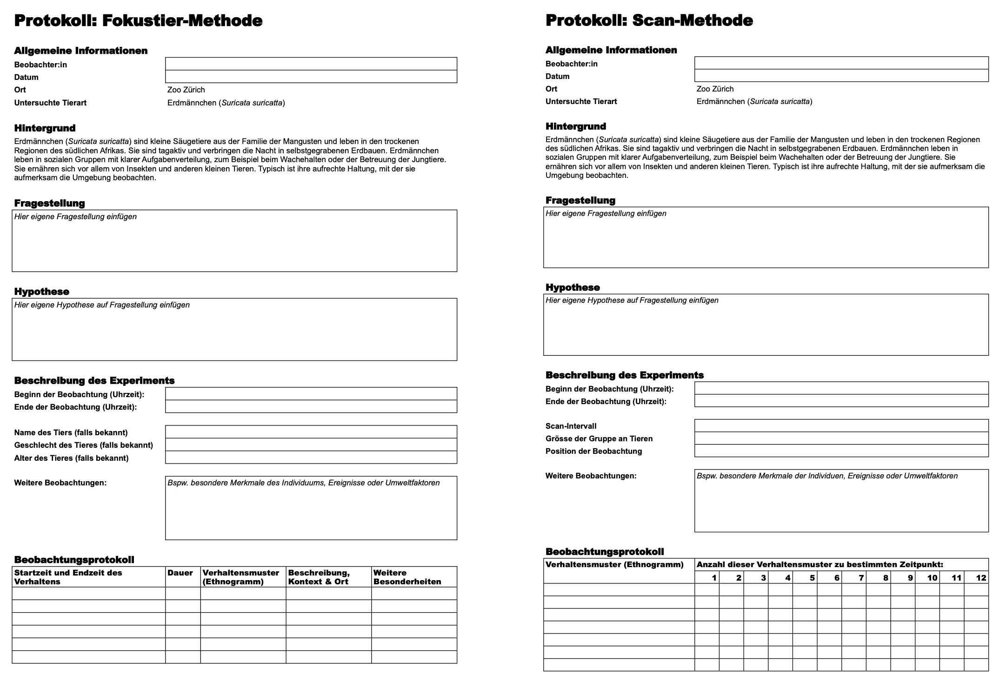

# Verhaltensforschung im Zoo {#Verhaltensforschung}


**Um das Gelernte auch praktisch anzuwenden, werden Sie in Zweiergruppen eine kleine Verhaltensstudie im Zoo durchführen. Da dies eine Exkursion ist, bearbeiten dieses Kapitel alle Schüler:innen der Klasse zur gleichen Zeit. **

<div class="exkurs">
<div class="exkurs-title">Hinweis</div>
Wenn Sie also schon vor der Exkursion in diesem Kapitel angelangt sind, springen Sie direkt zum nächsten und fahren Sie mit dem Kapitel 4 fort.
</div>


>**Lernziele**
>
>-	Sie können mithilfe Ihres Wissens über die Verhaltensbiologie und Verhaltensexperimente eine Beobachtungsstudie durchführen und Ihre Resultate systematisch und objektiv in einem Protokoll festhalten. 
>
>-	Sie können auffällige Umweltfaktoren, die das Verhalten der Tiere beeinflussen könnten, nennen und bei der Beobachtungststudie im Zoo dokumentieren.  
>
>-	Sie können die erhobenen Daten strukturieren, um Haupterkenntisse daraus abzuleiten. 


## Hintergrund zur Exkursion

Der Zoo Zürich hat mit der Eröffnung der Lewa-Savanne eine Anlage für Erdmännchen gebaut, die aus einem durch Fenster erkundbaren Innenteil und einem Aussenteil aufgebaut ist (Abb. \@ref(fig:fig3-1)). Aus den ursprünglich drei Tieren, die 2020 im Gehege freigesetzt worden sind, lebt heute dort eine Population von rund 20 Tieren. 

Während der Exkursion in den Zoo Zürich werden Sie eine der eigenen Fragestellungen und Hypothesen an der Erdmännchen-Anlage selbstständig anhand kleiner Beobachtungsstudien überprüfen.

```{r fig3-1, fig.cap='Die Erdmännchen-Anlage des Zoo Zürich.', out.width='80%', echo= F, fig.align= 'center'}
knitr::include_graphics('figures/fig3-1.png')
```

## Vorbereitung der Verhaltensstudie

Benutzen Sie zum Protokollieren Ihrer Ergebnisse der Verhaltensbeobachtung die unten verlinkte Google Sheets-Datei. Um diese Datei zu benutzen, melden Sie sich in Ihrem Account an, wählen Sie in der oberen Leiste «Datei» aus und klicken Sie auf «Kopie erstellen». Falls Sie lieber mit Microsoft Excel arbeiten möchten, erstellen Sie das Protokoll gemäss der Vorlage im Protokoll unten (siehe auch Abb. \@ref(fig:fig3-2)). Übertragen Sie in dieses Dokument auch Ihre Fragestellung und Hypothese, die Sie im Kapitel 2 erarbeitet haben. Das Protokoll müssen Sie am Ende der Exkursion digital abgeben. Es genügt, wenn eine Person pro Gruppe dieses Protokoll führt. 

Um die eigene Fragestellung zu untersuchen, müssen Sie folgende Sachen zur Exkursion in den Zoo mitbringen:  

-	Stoppuhr (bspw. auf Handy)

-	Kamera oder Handy für Foto- und Videoaufnahmen

-	Ihre digitalen Notizen zu den vorherigen Kapiteln (inkl. Fragestellung und Hypothese)

-	Protokoll zu der Verhaltensstudie 

-	Klemmbrett als Schreibunterlage, falls Sie im Zoo lieber analog arbeiten möchten

<br>

<a href="https://docs.google.com/spreadsheets/d/1lU9Bwmc03F4iuJgag1uLRwyMUFbiYMyRqTMQPnpwkFY/edit?gid=0#gid=0" download style="
  display: inline-block;
  padding: 10px 20px;
  font-size: 16px;
  background-color: #404f58;
  color: white;
  border-radius: 5px;
  text-decoration: none;
">
→ Protokoll-Vorlage
</a>

<br>
```{r fig3-2, fig.cap='Übersicht über die Protokolle der Scan- und der Fokustier-Methode.', out.width='80%', echo= F, fig.align= 'center'}

```

## Ablauf der Beobachtungsstudie

Befolgen Sie während der Beobachtungsstudie folgende Schritte:

1.	Wählen Sie ein einzelnes Tier oder eine kleine Gruppe von Tieren als Beobachtungseinheit.

2.	Halten Sie systematisch fest, welche Verhaltensweisen (gemäss Ethogramm) gezeigt werden, und halten Sie diese im Protokoll schriftlich fest.

3.	Achten Sie darauf, die Beobachtungen objektiv zu beschreiben – also ohne Interpretation oder Wertung.

4.	Notieren Sie zusätzlich besondere Ereignisse oder Umweltfaktoren (z. B. Fütterungszeiten, Wetter, andere Besucher), die das Verhalten beeinflussen könnten.

5.	Nutzen Sie Ihre Stoppuhr für Zeitmessungen einzelner Verhaltenselemente oder Intervallbeobachtungen.

6.	Dokumentieren Sie einzelne Sequenzen fotografisch oder per Video, um spätere Auswertungen zu erleichtern.

7.	Wiederholen Sie Ihre Beobachtungsstudien gegebenenfalls mit verschiedenen Tieren und zu verschiedenen Zeitpunkten. Überlegen Sie sich auch, warum das mehrfache Messen wichtig sein könnte. 

Falls Sie während der Beobachtungszeit im Zoo merken, dass sich Ihre Fragestellung nur schwer überprüfen lässt, können Sie diese natürlich auch noch im Zoo selbst anpassen. 


## Mastery Check

Nach der Datenerhebung fassen Sie die Resultate in wenigen Sätzen zusammen, um das, was Sie beobachtet haben, objektiv und gebündelt nochmals darzustellen. Fragen Sie sich hierzu, was die wichtigsten Erkenntnisse Ihrer Beobachtungen sind, gehen Sie darauf ein, ob es regelmässige Muster gibt oder welche Details am wichtigsten sind, um die ursprüngliche Fragestellung zu beantworten. Halten Sie diese Überlegungen ebenfalls am Ende Ihres Protokolls schriftlich fest. Sie müssen die Resultate noch nicht interpretieren. Dies wird Teil der Aufgaben in den folgenden Kapiteln sein.

Als **Mastery Check** dieses Kapitels senden Sie das Protokoll Ihrer Studie als PDF an die Lehrperson (via Teams oder E-Mail). Fügen Sie es auch als PDF in Ihr Antworten-Dokument ein. 
