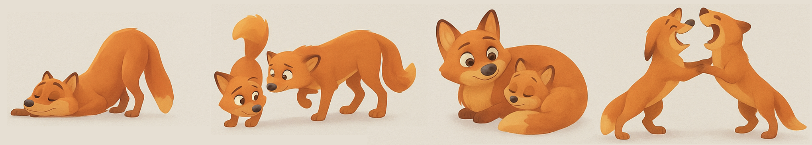
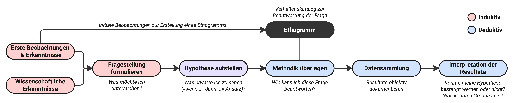

# Verhaltensstudien {#Verhaltensstudien}

**Die bis anhin behandelten Themen waren zu einem Grossteil theoretischer Natur. Damit haben wir uns eine wichtige theoretische Grundlage geschaffen, um in der Natur Verhalten zu beschreiben. In diesem zweiten Kapitel geht es nun darum, dieses Wissen an echten Beispielen aus dem Tierreich anzuwenden.**

 

>**Lernziele**
>
>-	Sie können den Begriff «Ethnogramm» definieren und ohne Hilfsmittel dessen Bedeutung für die Verhaltensforschung in 1-2 Sätzen festhalten. 
>
>-	Sie können eine wissenschaftliche Fragestellung aus vorherigen Beobachtungen entwickeln und mithilfe einer Literaturrecherche eine plausible Hypothese formulieren, die überprüfbar ist. 
>
>-	Sie können die Scan- und die Fokustier-Methode in 3 Aspekten ohne Hilfsmittel voneinander unterscheiden und in 2-3 Sätzen begründen, welche Methode für konkrete Fragestellungen am besten geeignet ist. 
>
>-	Sie können mithilfe des Skripts eine einfache Verhaltensstudie inkl. Fragestellung, Hypothese, Beobachtungsmethode und ersten Überlegungen zur Datenerhebung erstellen. 

## Ethnogramme

Unabhängig davon, ob wir induktiv aus Beobachtungen eine Hypothese ableiten oder deduktiv eine bestehende Hypothese experimentell überprüfen möchten, benötigen wir eine objektive Methode, um Verhaltensmuster und -elemente präzise zu erfassen. Die systematische Auflistung dieser Verhaltenselemente bildet das sogenannte Ethogramm: ein Inventar der allermeisten beobachtbaren Verhaltensweisen eines Tieres (Abb. \@ref(fig:fig2-1)). Eine Verhaltensweise ist dabei ein klar abgrenzbares und wiedererkennbares Verhalten, das sich deutlich von anderen Verhaltensmustern unterscheidet. Das Ethogramm ermöglicht es, solche Verhaltensweisen in der Natur objektiv zu beschreiben und quantifizierbar zu machen.

(\#fig:fig2-1)Illustrierte Auswahl von Verhaltenselemente des Fuchses: Strecken, Beschnuppern, Jungtier-Pflege, oder das gemeinsame Spielen. Verhaltensweisen können kurze Ereignisse darstellen wie das Strecken, aber auch lange andauern, wie beispielsweise schlafen oder Wache halten.

Ethogramme sind stark abhängig von der Tierart, die untersucht werden soll. Existiert bereits ein Verhaltenskatalog, kann direkt mit einer konkreten Fragestellung gearbeitet werden. Eine solche Fragestellung könnte zum Beispiel untersuchen, wie sich das Verhalten eines Gruppenmitglieds verändert, wenn ein neues Tier zum Rudel hinzustösst. Wenn hingegen noch kein Ethogramm vorhanden ist, muss dieses zunächst durch gezielte Beobachtung und sorgfältige Protokollierung erstellt werden.

 

● **Aufgabe 1 | Wissen verknüpfen.** Folgt das Erstellen eines Verhaltenskatalogs eher einem induktiven oder deduktiven Erkenntnisgewinn? Begründen Sie Ihre Antwort. 

 

<a href="javascript:void(0);" onclick="toggleIframe()" style="
  display: inline-block;
  padding: 10px 20px;
  font-size: 16px;
  background-color: #404f58;
  color: white;
  border-radius: 5px;
  text-decoration: none;
">→ Antworten mit KI überprüfen</a>

  <iframe src="https://stobler.shinyapps.io/verhaltensbiologie" width="100%" height="600px" style="border: 1px solid #ccc;"></iframe>

## Das Ethnogramm des Erdmännchens

Verhaltensuntersuchungen am Erdmännchen (_Suricata suricatta_) gelten als besonders wertvoll, da diese Tiere in sozialen Gruppen leben und sich ihre Interaktionen dadurch systematisch beobachten und analysieren lassen (Abb. \@ref(fig:fig2-2)). Aus diesem Grund existieren bereits detaillierte Verhaltenskataloge, welche die unterschiedlichen Verhaltensmuster von Erdmännchen beschreiben.

(\#fig:fig2-2)Erdmännchen (_Suricata suricatta_) sind im südlichen Regionen Afrikas beheimatet und leben in kleinen Gruppen. 

○ **Aufgabe 2.** Ein Verhaltenskatalog des Erdmännchens ist in der Tabelle \@ref(tab:tab2-1) unten vereinfacht dargestellt. Schauen Sie sich diesen genau durch und versuchen Sie nachzuvollziehen, was die unterschiedlichen Verhaltensmuster zeigen könnten. 

 

Table: (\#tab:tab2-1) Auswahl an Verhaltenselementen und deren Ausprägungsvarianten in Erdmännchen. Bitte beachten Sie, dass diese Liste nicht vollständig ist, sondern nur diejenigen Elemente aufzeigt, die bei einer ersten Beobachtung am wahrscheinlichsten vorkommen.

| Verhaltenselement     | Ausprägungsvariante                                                                 |
|------------------------|-------------------------------------------------------------------------------------|
| Körperhaltung          | Aufrecht (sitzend, stehend), liegen (gerollt, gestreckt, kauernd)                  |
| Bewegung               | Gehen, scharren, rennen, klettern                                                  |
| Nahrungsaufnahme       | Feste Nahrung, Flüssigkeit                                                         |
| Spielverhalten         | Mit Objekt, mit anderem Individuum                                                 |
| Territorialverhalten   | Markieren von Orten oder Interaktion mit Artgenossen                               |
| Sozialverhalten        | Wache halten, Jungtierpflege, Fütterung                                            |
| Sexualverhalten        | Prüfen, decken                                                                     |
| Dominanzverhalten      | Aggressiv dominant (drohen, aufrichten, beissen, kämpfen), unterwürfig (ducken, Rückenlage) |
| Komfortverhalten       | Ruhen und schlafen, Selbstpflege (putzen, kratzen)                                 |

 

<a href="javascript:void(0);" onclick="toggleIframe2()" style="
  display: inline-block;
  padding: 10px 20px;
  font-size: 16px;
  background-color: #404f58;
  color: white;
  border-radius: 5px;
  text-decoration: none;
">→ Antworten mit KI überprüfen</a>

  <iframe src="https://stobler.shinyapps.io/verhaltensbiologie" width="100%" height="600px" style="border: 1px solid #ccc;"></iframe>

## Fragestellungen entwickeln 

Mithilfe eines Ethogramms lassen sich bereits erste Verhaltensexperimente mit Tieren durchführen. Die systematische Beobachtung tierischer Verhaltensweisen anhand dieses Verhaltenskatalogs spielt dabei eine zentrale Rolle.

Diese Art der Beobachtung unterscheidet sich deutlich vom beiläufigen Beobachten von Amseln im Wald oder Chirurgenfischen im Meer. Es handelt sich vielmehr um einen aktiven Prozess: gezieltes Suchen, präzises Beschreiben und strukturiertes Dokumentieren ohne das Verhalten vorschnell zu interpretieren. Im Zentrum steht stets eine klare Fragestellung, auf die das Beobachtungsprotokoll ausgerichtet ist.

Solche Fragestellungen ergeben sich häufig aus ersten eigenen Beobachtungen oder aus den Ergebnissen früherer wissenschaftlicher Untersuchungen. In Beobachtungsstudien geht es meist darum herauszufinden, wie, wann oder wo bestimmte Verhaltensweisen auftreten. Als Beispiel könnte man untersuchen, wo die Tiere schlafen, ob sich dieses Verhalten im Winter verändert und wie sie reagieren, wenn plötzlich eine Gefahr auftritt.

Basierend auf eigenen Vorkenntnissen oder Erkenntnissen aus anderen Quellen formuliert man anschliessend eine überprüfbare Hypothese und gelangt damit wieder zum deduktiven Erkenntnisgewinn. Die Hypothese wird anhand gezielter Beobachtungen überprüft, wobei die Resultate sachlich dokumentiert, aber nicht interpretiert werden. Eine Übersicht über den gesamten wissenschaftlichen Prozess findet sich nochmals in Abbildung \@ref(fig:fig2-3).

(\#fig:fig2-3)Detailübersicht über den wissenschaftlichen Arbeitsprozess in der Verhaltensbiologie. Das induktive (rot) und deduktive Denken (blau) ergänzen sich dabei und werden besonders in der Verhaltensbiologie oft mehrfach durchlaufen. 

● **Aufgabe 3.** Überlegen Sie sich 2-3 eigene Fragestellungen, die man am Verhalten des Erdmännchens unter Einbezug des Ethnogramms (Tabelle \@ref(tab:tab2-1)) mit einfachen Mitteln untersuchen könnte. 

◑ **Aufgabe 4.** Um eine begründete Hypothese zu Ihrer Fragestellung aufstellen zu können, benötigen Sie Hintergrundwissen über das Verhalten von Erdmännchen. Als Vorbereitung auf die Exkursion (Kapitel 3) und die dazugehörige Verhaltensstudie bietet das unten verlinkte Video (Abb. \@ref(fig:fig2-4)) einen ersten Einblick in das Verhalten dieser Tiere. 

Wählen Sie einen beliebigen Zeitpunkt im Video aus, beobachten Sie die Erdmännchen während ein paar Minuten bei verschiedenen Aktivitäten und nutzen Sie dabei das Ethogramm zur Orientierung. Formulieren Sie anschliessend auf Basis Ihrer Beobachtungen eine Hypothese zu einer der in Aufgabe 3 entwickelten Fragestellungen.

 

<iframe width="560" height="315" align = "center" style = "margin-bottom: 0px" src="https://www.youtube.com/embed/nMk_THwoX18?si=PRqa9SL_W9kP4C7p" title="YouTube video player" frameborder="0" allow="accelerometer; autoplay; clipboard-write; encrypted-media; gyroscope; picture-in-picture; web-share" referrerpolicy="strict-origin-when-cross-origin" allowfullscreen></iframe>

(\#fig:fig2-4)Video aus dem Zoo in San Diego über Erdmännchen. Bei Minute 0 sind viele Erdmännchen am Scharren und Umherlaufen, ab Minute 18 sind auch andere Verhaltensmuster zu erkennen.

<a href="javascript:void(0);" onclick="toggleIframe3()" style="
  display: inline-block;
  padding: 10px 20px;
  font-size: 16px;
  background-color: #404f58;
  color: white;
  border-radius: 5px;
  text-decoration: none;
">→ Antworten mit KI überprüfen</a>

  <iframe src="https://stobler.shinyapps.io/verhaltensbiologie" width="100%" height="600px" style="border: 1px solid #ccc;"></iframe>

#### Für die Erdmännchen-Begeisterten {.unnumbered}

Für die Erdmännchen-Begeisterten. Wenn Sie ebenso fasziniert vom Verhalten und der Lebensweise der Erdmännchen sind, finden Sie auf YouTube zahlreiche sehenswerte Dokumentationen, zum Beispiel von BBC Earth, die das Leben dieser Tiere in der Wildnis eindrücklich zeigen – ideal zur Vertiefung ausserhalb der Schulzeit.

## Methoden der Verhaltensforschung

Wenn dann die Fragestellung steht und man eine Hypothese, die man untersuchen möchte, definiert hat, geht es endlich an die eigentliche quantitative Datensammlung: die deduktive Phase des wissenschaftlichen Arbeitens. 

Mögliche Methoden, wie Daten erhoben werden können, gibt es in der Verhaltensbiologie zahlreiche. Im Folgenden werden wir zwei genauer anschauen: die Fokustier-Methode und die Scan-Methode.

### Fokustier-Methode

In der Fokustier-Methode wählen Sie ein spezifisches Tier aus und beobachten dieses für einen bestimmten Zeitrahmen. Dabei notieren Sie sich, welche Verhaltenselemente das Tier zeigt und wie lange Zeit das jeweilige Element dauert. Dabei kann man entweder alle Elemente aufnehmen oder sich auf spezifische Verhaltensmuster fokussieren. Zudem erlaubt diese Methode die Sequenz von Verhaltenselementen zu analysieren. Wenn man diese Methode untereinander aufteilt oder wiederholt, können auch alle Tiere angeschaut werden. 

### Scan-Methode

In der Scan-Methode beobachten Sie eine ganze Gruppe von Individuen über einen vorher definierten Zeitraum. In regelmässigen Zeitabständen (bspw. jede Minute bei hoher Aktivität oder alle 10 Minuten bei geringer Aktivität) wird dann das Verhalten jedes Individuums erfasst und in den Verhaltenskategorien (Ethnogramm) zusammengefasst. Dabei kann es hilfreich sein, den Moment in einem Foto oder kurzen Film festzuhalten, um so die Verhaltensmuster zu bestimmen. 

## Mastery Check

**Aufgabe 5 | Mastery Check.** Überlegen Sie sich für jede Ihrer in Aufgabe 3 definierten Forschungsfragen, welche der beiden Methoden besser geeignet wäre, um diese zu beantworten. Halten Sie Ihre Überlegungen schriftlich fest und zeigen Sie diese der Lehrperson als Mastery Check dieses Kapitels. 
