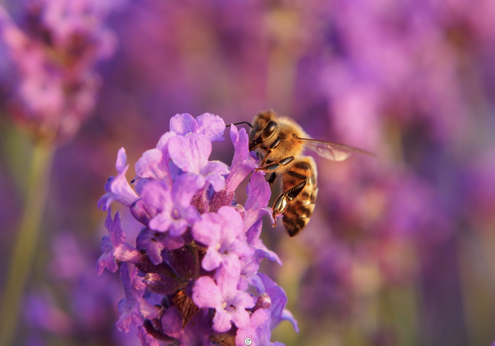
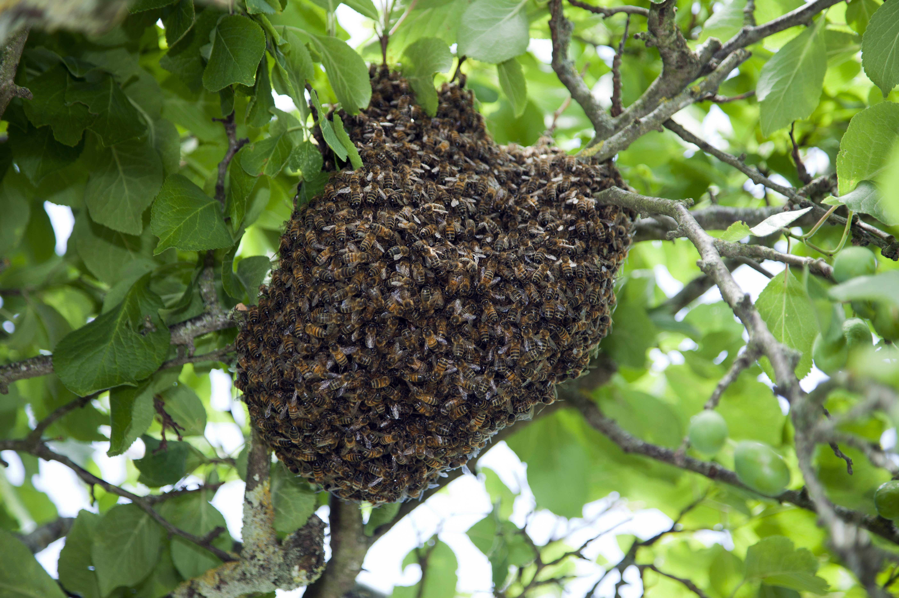

# Altruismus {#Altruismus}

**Altruistisches Verhalten ist ein faszinierendes Phänomen, das auf den ersten Blick im Widerspruch zur individuellen Fitness steht. Ziel dieses Kapitels ist es, zu verstehen, wie solches Verhalten evolutionär erklärbar ist. Sie lernen, den Verwandtschaftsgrad zu berechnen, zwischen direkter und indirekter Fitness zu unterscheiden und den Begriff «Altruismus» einzuordnen. Zudem erfahren Sie, was eine evolutionär stabile Strategie ausmacht.**

  

> **Lernziele:** Am Ende dieses Kapitels können Sie...  
> - erklären, warum ... 
> - darlegen, wie ...

## Verwandtschaftsverhältnisse

Sind die Abstammungsverhältnisse von diploiden, sich sexuell fortpflanzenden Organismen bekannt, kann der Verwandtschaftsgrad und damit der Verwandtschaftskoeffizient $r$ bestimmt werden. Dieser Wert gibt dabei die Wahrscheinlichkeit an, mit der ein Lebewesen aufgrund seiner Abstammung von seinen Vorfahren ein bestimmtes Allel besitzt. Graphisch lassen sich die Verwandtschaftsverhältnisse wie in Abb. \@ref(fig:fig3-1). darstellen.

(\#fig:fig3-1)Verwandtschaftsverhältnisse über vier Generationen.

Kreise entsprechen dabei einzelnen Individuen und Pfeile geben die Abstammungsrichtung an. Da der Entstehung der Gameten eine Meiose (Reifeteilung) vorangeht, ist die Wahrscheinlichkeit für ein Allel, in eines der Kinder zu kommen, $0.5$ oder $50$%. Wenn das Allel über mehrere Generationen n weitergegeben wird, so halbiert sich die Wahrscheinlichkeit für jede Generation. 

Der Verwandtschaftskoeffizient lässt sich demnach wie folgt berechnen: Die Wahrscheinlichkeit eines Allels aufgrund von Verwandtschaftsverhältnissen in zwei Individuen vorhanden zu sein, ist $r = 0.5^n$. Gibt es mehrere Wege, von einem Individuum zum anderen zu kommen, summieren sich diese Wahrscheinlichkeiten.

> **Beispiel:** $r$ für Individuen 1 und 3: Nur ein Weg ist möglich und zwei Schritte sind nötig. Daher ist $r=0.5^2=0.25$. Die Wahrscheinlichkeit, dass der Enkel ein bestimmtes Allel des Grossvaters besitzt, ist also $25$%. 

### Wissen überprüfen {.unnumbered}

> Lösen Sie folgenden Aufgaben selbstständig. Mit einem Stern (✦) markierte Aufgaben sind fakultativ. 
> Halten Sie Ihre Resultate fest, damit Sie später wieder darauf zurückgreifen können. Überprüfen Sie diese dann mithilfe der Applikation unten.  

**Aufgabe 1**. Erklären Sie die Formel $r=0.5^n$ in eigenen Worten. 

**Aufgabe 2**. Berechnen Sie $r$ für Individuen 2 und 4, sowie Individuen 3 und 4. 

**✦ Aufgabe 3**. Berechnen Sie $r$ für Individuen 4 und 5.

<iframe src="https://stobler.shinyapps.io/verhaltensbiologie_kp3/" width="100%" height="600px" style="border: 1px;"></iframe>

 

## Altruistisches Verhalten bei Bienen

### Der Bienenstock – eine Grossfamilie

Ein Bienenstock besteht während der Hauptsaison normalerweise aus un-gefähr 30.000 bis 40.000 Individuen, die meisten davon Arbeiterinnen – weibliche Bienen, die für die Aufzucht der Jungen oder das Sammeln von Pollen und Nektar verantwortlich sind (Abb. \@ref(fig:fig3-2)). Neben den Arbeiterinnen leben auch eine Königin sowie männliche Bienen, die Drohnen, im Bienenstock. Drohnen sind jedoch nur während der Fortpflanzungssaison anwesend.

(\#fig:fig3-2)Honigbiene an Lavendelblüte.

Die Arbeiterinnen, sind genetisch betrachtet (Halb-)Schwestern, da sie von derselben Königin abstammen. Sie können allerdings unterschiedliche Väter haben, da die Königin typischerweise Nachkommen von durchschnittlich zwölf Drohnen zeugt. Dadurch sinkt der Verwandtschaftsgrad zwischen den Arbeiterinnen im Vergleich zur Königin. Folglich unterstützen die Arbeiterinnen eher die Königin als ihre Schwestern, um die Weitergabe des eigenen Erbguts zu fördern.

Die Königin legt befruchtete und unbefruchtete Eier (Abb. \@ref(fig:fig3-3)). Die befruchteten Eier entwickeln sich zu diploiden Arbeiterinnen oder, unter besonderen Bedingungen, zu neuen Königinnen, während die unbefruchteten Eier zu Drohnen heranwachsen. Da Drohnen aus den unbefruchteten Eiern entstehen, besitzen sie nur genomisches Material der Mutter. Sie sind also haploid und besitzen nur einen einfachen Chromosomensatz. 

(\#fig:fig3-3)Verwandtschaftsverhältnisse der Honigbiene.

Aufgrund dieser Unterschiede in der Anzahl Chromosomensätze in den Kindern der Bienenkönigin, ist die Berechnung der Verwandtschaftskoeffizienten $r$ nicht mehr ganz so einfach, wie das die Formel aus dem vorherigen Kapitel suggeriert. 

Vielmehr muss diese um verschiedene Faktoren erweitert werden, um für die Ploidie (Anzahl Chromosomensätze) und Anzahl Wege zwischen zwei Individuen im Stammbaum aufzukommen. Da die saubere Erarbeitung dieser Verwandtschaftskoeffizienten den Rahmen dieser Unterrichtseinheit sprengen würde, berechnen wir diese Werte nicht zusammen. Wer sich die Berechnungen genauer anschauen möchte, kann sich freiwillig mit dem Vertiefungsmaterial zu den Verwandtschaftsbeziehungen beschäftigen. 

Die Verwandtschaftskoeffizienten innerhalb eines Bienenstocks variieren stark, abhängig davon, ob die Tiere haploid oder diploid sind und ob sie vom selben Vater abstammen. Die Tabelle \@ref(tab:tab3-1) fasst diese für die unterschiedlichen Beziehungen zusammen. 

Wenn wir die Verwandtschaftskoeffizienten der Arbeiterinnen genauer anschauen, stellt man fest, dass der Wert $r$ für Schwestern (Arbeiterinnen mit gleichem Vater) höher ist, als wenn zu den eigenen (theoretischen) Kindern. In diesem Fall wäre nämlich $r= 0.5$. Aus evolutionärer Perspektive gelingt also das Fördern der eigenen Gene eher, wenn in den Reproduktionserfolg der Schwestern investiert wird, welche sich zu neuen Königinnen entwickeln können. 

 

Table: (\#tab:tab3-1)Verwandtschaftskoeffizienten bei Honigbienen.

|Verwandtschaft    |Bienenkönigin (Mutter) |Drohne (Vater) |Arbeiterin (Kind) mit gleichem Vater |Arbeiterin (Kind) mit unterschiedlichem Vater |
|:-----------------|:----------------------|:--------------|:------------------------------------|:---------------------------------------------|
|Drohne (Kind)     |$r = 1$                |–              |$r = 0.5$                            |$r = 0.5$                                     |
|Arbeiterin (Kind) |$r = 0.5$              |$r = 1$        |$r = 0.75$                           |$r = 0.25$                                    |

 

### Die Arbeit als Wächterin 

Im Bienenstock übernehmen spezialisierte Arbeiterinnen die Rolle der Wächterinnen, um die Kolonie vor Eindringlingen wie Wespen, Räubern oder anderen Bienen zu schützen (Abb. \@ref(fig:fig3-4)). Diese Wächterinnen postieren sich am Eingang des Stocks und kontrollieren, ob ankommende Bienen durch ihren Duft zur eigenen Kolonie gehören. Im Falle eines Angriffs verteidigen sie den Stock entschlossen, oft unter Einsatz ihres Lebens. Da der Stachel von Honigbienen aufgrund der Widerhaken nach dem Stechen in der Haut der Angreifenden stecken bleibt, sterben sie nach einem solchen Einsatz. 

(\#fig:fig3-4)Der Bienenstock.

### Wissen überprüfen und anwenden {.unnumbered}

> Lösen Sie folgenden Aufgaben selbstständig. 
> Halten Sie Ihre Resultate fest, damit Sie später wieder darauf zurückgreifen können. Überprüfen Sie diese dann mithilfe der Applikation unten.  

**Aufgabe 1**. Die Kosten dieses der Wächterin Verhaltens könnten nicht höher sein. Erklären Sie mögliche Nutzen dieses Verhaltens im Kontext des Optimalitätsprinzips.

**Aufgabe 2**. Das Verhalten der Wächterin wird oft als «altruistisch» bezeichnet. Stellen Sie eine Definition für dafür auf. Beziehen Sie sich dabei auf ultimate Verhaltensursachen. 

**Aufgabe 3**. Überlegen Sie sich, von welchen Faktoren «Fitness» im evolutiven Kontext abhängt. Was ist der Einfluss des altruistischen Verhaltens der Arbeiterinnen auf die Fitness?

<iframe src="https://stobler.shinyapps.io/verhaltensbiologie_kp3/" width="100%" height="600px" style="border: 1px;"></iframe>

## Die Regel von Hamilton

(\#fig:fig3-5)Evolutionsbiologe William Hamilton in einem Seminar in Harvard, 1978.

Die Regel von William Hamilton (Abb. \@ref(fig:fig3-5)) zur Evolution von altruistischem Verhalten besagt, dass ein Verhalten dann vorteilhaft ist, wenn der genetische Gewinn durch die Verwandten die eigenen Kosten überwiegt. Dazu hat er folgende Regel aufgestellt: 

$$
N/K=k>1/r 
$$

mit $k$ als Verhältnis von Kosten $K$ und Nutzen $N$ und $r$ für den uns bereits bekannten Verwandtschaftskoeffizienten. Altruismus wird also gefördert, wenn das Kosten-Nutzen-Verhältnis grösser als der reziproke Wert des Verwandtschaftskoeffizienten ist. 

### Wissen überprüfen und anwenden {.unnumbered}

> Lösen Sie folgenden Aufgaben selbstständig. 
> Halten Sie Ihre Resultate fest, damit Sie später wieder darauf zurückgreifen können. Überprüfen Sie diese dann mithilfe der Applikation unten.  

**Aufgabe 1**. Welches Tier hat eine höhere Fitness, eines das auf 2 eigene Nachkommen verzichtet, dafür einem Geschwister hilft, 5 Nachkommen zu produzieren, oder ein Tier, das nicht hilft? (Annahme: diploide Art)

**Aufgabe 2**. Wie sähe die Situation aus, wenn das erste Tier auf 3 Nachkommen verzichten müsste?

<iframe src="https://stobler.shinyapps.io/verhaltensbiologie_kp3/" width="100%" height="600px" style="border: 1px;"></iframe>

## Evolutionär stabile Strategien

### Definition {.unnumbered}

Das Verhalten der Arbeiterbienen, ihr Leben für den Schutz des eigenen Bienenvolkes zu opfern, stellt eine evolutionär stabile Strategie (ESS) dar. Diese Strategie gewährleistet lang-fristig das Überleben der Kolonie und eine erfolgreichere Reproduktion. Dadurch bleibt das Verhalten stabil, da es das Überleben und die Weitergabe der Gene ermöglicht. Daher ist in diesem Falle der Altruismus eine evolutionär stabile Strategie. 

### Wissen anwenden {.unnumbered}

> Lösen Sie folgenden Aufgaben selbstständig. 
> Halten Sie Ihre Resultate fest, damit Sie später wieder darauf zurückgreifen können. Überprüfen Sie diese dann mithilfe der Applikation unten.  

**Aufgabe 1**. Welche weiteren Formen nebst der Verwandtenselektion könnten Altruismus als evolutionär stabile Strategie etablieren? Nennen Sie mindestens 2. 

<iframe src="https://stobler.shinyapps.io/verhaltensbiologie_kp3/" width="100%" height="600px" style="border: 1px;"></iframe>

