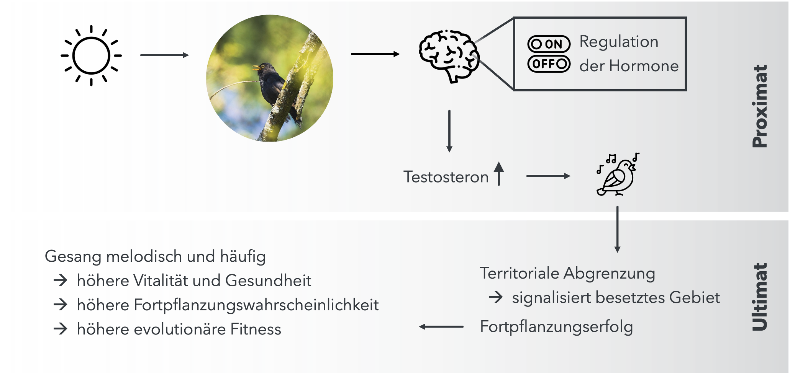

# Verhalten erklären {#Verhaltenserklaerungen}

**Beobachtungsstudien an Tieren ermöglichen es, Verhaltensmuster zu erkennen und in Beziehung zueinander zu setzen. Streicheln wir eine Katze, beginnt sie zu schnurren. Fühlt sie sich hingegen bedroht, kann dieses Schnurren rasch in ein Fauchen umschlagen. Daraus ergibt sich auch die Frage, warum wir ein bestimmtes Verhalten überhaupt beobachten können. Wir nähern uns damit in diesem Kapitel der Interpretation unserer selbst erhobenen Resultate einen entscheidenden Schritt. **

 

>**Lernziele**
>
>- Sie können in wenigen Sätzen Ihrer Grossmutter erklären, was man unter proximaten und ultimaten Verhaltensursachen versteht und diese Perspektiven anwenden, um ein Verhaltensmuster zu erklären. 
>
>-	Sie können den evolutiven Zusammenhang zur Entwicklung von ultimatem Verhalten in eigenen Worten zusammenfassen. 
>
>-	Sie können erklären, was man unter dem Optimalitätsprinzip versteht und in diesem Kontext eine Kosten-Nutzen-Analyse an einem neuen Beispiel durchführen.  
>
>-	Sie können ohne Hilfsmittel erläutern, warum Verhalten evolutiv als Kompromiss zwischen Nutzen und Kosten entsteht.
>
>-	Sie können Ihre eigenen Beobachtungen aus dem Zoo analysieren, um diese aus ultimater Betrachtungsweise zu erklären.

## Verhaltensursachen

Die Merkmale aller Lebewesen sind das Ergebnis evolutiver Anpassungen an ihre Umwelt. Jedes Verhalten birgt dabei einen bestimmten Nutzen, ist jedoch oft mit Kosten verbunden, sei es in Form von Energieaufwand, Nahrung oder Einbussen im Fortpflanzungserfolg. Aus evolutiver Sicht stellen das Überleben und die Weitergabe der eigenen Gene somit stets eine Abwägung zwischen Kosten und Nutzen dar. 

### Das Singen der Amseln {.unnumbered}

Sobald die Tage im Frühling etwas wärmer werden und die Sonne wieder früher über den Horizont steigt, beginnen Amseln ihre melodischen Lieder zu singen. Dieses Verhalten ist eng mit den längeren Tagen zu dieser Jahreszeit verbunden. Wenn die Tage länger werden und die Lichtintensität steigt, nimmt das auch die Amsel über ihre Augen wahr. Diese visuellen Informationen werden im Gehirn kombiniert und beeinflussen die Regulation des Hormonhaushaltes. Die Ausschüttung von Hormonen wie Testosteron wird ausgelöst (Abb. \@ref(fig:fig4-1)). 

Testosteron beeinflusst wiederum spezielle Gehirnregionen, die für das Erlernen und Ausführen von Gesang verantwortlich sind. Dieser Ablauf erklärt die proximaten Ursachen des Singverhaltens: Es sind die direkten, körperlichen Prozesse, die dafür sorgen, dass die Amsel singt.

Aber warum singt die Amsel überhaupt? Aus einer evolutionären Perspektive wird das deutlich: Der Gesang hilft der Amsel, ein Revier zu markieren. Wenn ein anderes Männchen das Lied hört, erkennt es, dass dieses Gebiet bereits besetzt ist, und bleibt im besten Fall fern. 

Zudem ist der Gesang auch für den Fortpflanzungserfolg essenziell. Die weiblichen Amseln hören aufmerksam zu und beurteilen die Qualität des Gesangs. Ein Männchen, das besonders laut, oft und melodisch singt, zeigt damit, dass es gesund und stark ist. Das beeindruckt die Weibchen, die sich oft für einen Sänger mit dem besten Gesang entscheiden. Dieses Verhalten erhöht die Wahrscheinlichkeit, dass die Amsel ihre Gene weitergeben kann. Man spricht von ultimaten Ursachen des Verhaltens, die sich im Kontext evolutiver Selektionsmechanismen einordnen lassen (siehe Box unten zur Repetition und Vertiefung dieser Konzepte).

(\#fig:fig4-1)Proximate und ultimate Ursachen des Gesangs der Amsel (_Turdus merula_). 

Vertiefung: Selektionsmechanismen

Verhaltensweisen wie der Gesang der Amsel sind das Ergebnis evolutiver Selektionsprozesse. Dabei wirken unterschiedliche Mechanismen zusammen, die bestimmen, welche Merkmale sich in einer Population langfristig durchsetzen. Oft lassen sich Verhaltensweisen nur durch das Zusammenspiel von natürlicher und sexueller Selektion vollständig erklären.

Merkmale, die das Überleben eines Individuums in seiner Umwelt begünstigen, sind mit einer höheren Fitness verbunden. Man spricht dabei von **natürlicher Selektion**. Beim Amselgesang kann dies beispielsweise die effektive Reviermarkierung sein, die Konkurrenz reduziert und den Zugang zu Ressourcen sichert.

Merkmale, die den Fortpflanzungserfolg erhöhen, können sich auch dann durchsetzen, wenn sie mit Kosten verbunden sind, etwa durch erhöhten Energieaufwand oder ein höheres Prädationsrisiko. Man spricht also von **sexueller Selektion**. Der Gesang der Amsel dient unter anderem dazu, Weibchen anzuziehen und deren Partnerwahl zu beeinflussen.

○ **Aufgabe 1.** Definieren Sie mithilfe der Informationen aus dem Text, was man unter proximaten und ultimaten Verhaltensweisen versteht.   

◑ **Aufgabe 2.** Warum ist es in der Verhaltensbiologie wichtig, beide Perspektiven zu betrachten?

● **Aufgabe 3 | Wissen verknüpfen.** Welche Selektionsmechanismen haben wahrscheinlich den grössten Einfluss auf die evolutive Entwicklung des Gesangs von Amseln?

 

<a href="javascript:void(0);" onclick="toggleIframe()" style="
  display: inline-block;
  padding: 10px 20px;
  font-size: 16px;
  background-color: #404f58;
  color: white;
  border-radius: 5px;
  text-decoration: none;
">→ Antworten mit KI überprüfen</a>

  <iframe src="https://stobler.shinyapps.io/verhaltensbiologie" width="100%" height="600px" style="border: 1px solid #ccc;"></iframe>

## Kosten und Nutzen von Verhalten

Wenn wir das Verhalten der Amsel aus ultimater und proximater Perspektive beleuchten, haben wir bereits ein recht gutes Verständnis davon, warum dieses Verhalten auftreten könnte. Während die proximaten Erklärungsansätze der Frage nachgehen, wie ein Verhalten funktioniert und dabei auf die unmittelbaren (zellulären) Mechanismen fokussieren, widmet sich die ultimate Betrachtung der Frage, warum sich dieses Verhalten über viele Generationen hinweg langfristig entwickelt hat. Es geht also um die Funktion des Verhaltens im evolutiven Kontext.

Im Zusammenhang mit den ultimaten Ursachen von Verhalten betrachten wir oft sowohl die Kosten als auch die Nutzen, die ein bestimmtes Verhalten oder Merkmal für das Individuum mit sich bringt.

Ein klassisches Beispiel dafür sind die auffälligen Federn des männlichen Pfaus (Abb. \@ref(fig:fig4-2)). Auf den ersten Blick ist klar, wen er mit diesem imposanten Gefieder beeindrucken möchte: Pfaue zeigen dieses Verhalten im Rahmen des Balzverhaltens, um Weibchen auf sich aufmerksam zu machen.

(\#fig:fig4-2)Die Federpracht des Pfaus (_Pavo cristatus_). 

Besonders grosse und symmetrische Federn gelten bei Weibchen als attraktiv. Sie erhöhen somit die Fortpflanzungschancen des Männchens und sind daher ein klarer evolutionärer Nutzen. Gleichzeitig sind diese Federn mit erheblichen Kosten verbunden: Sie erschweren die Flucht vor Fressfeinden und machen das Tier auffälliger. Zudem erfordert ihr Aufbau und ihre Pflege viel Energie, die dem Tier an anderer Stelle, etwa bei Nahrungssuche oder Immunabwehr, fehlen kann.

 

◑ **Aufgabe 4.** Die grossen Federn des Pfaus gehen also auch mit signifikanten Kosten für das Verhalten einher. Warum könnte genau dies für die Weibchen eine attraktive Ausstrahlung haben?  

◑ **Aufgabe 5.** Machen Sie eine Kosten-Nutzen-Analyse des Amselgesangs, den wir im Kapitel 4.1 besprochen haben. Gehen Sie auf mindestens einen Nutzen und einen Kostenpunkt ein. 

● **Aufgabe 6.** Im Zusammenhang mit der Kosten-Nutzen-Analyse spricht man häufig vom Optimalitätsprinzip. Überlegen Sie sich, was darunter gemeint sein könnte und erarbeiten Sie eine Definition dieses Prinzips.  

 

<a href="javascript:void(0);" onclick="toggleIframe2()" style="
  display: inline-block;
  padding: 10px 20px;
  font-size: 16px;
  background-color: #404f58;
  color: white;
  border-radius: 5px;
  text-decoration: none;
">→ Antworten mit KI überprüfen</a>

  <iframe src="https://stobler.shinyapps.io/verhaltensbiologie" width="100%" height="600px" style="border: 1px solid #ccc;"></iframe>

## Mastery Check: Warum Erdmännchen Wache stehen

In Beobachtungsstudien wie derjenigen im Zoo findet die Erklärung der Resultate häufig auf der ultimaten Betrachtungsebene statt. Dabei stehen Fragestellungen im Zentrum wie: «Warum übernehmen Erdmännchen abwechselnd die Rolle des Wächters?» oder «Warum kommunizieren Erdmännchen bei unterschiedlichen Bedrohungen mit verschiedenen Lauten?». Solche Fragen lassen sich nur beantworten, wenn das beobachtete Verhalten im evolutionären Kontext betrachtet wird.

 

**Aufgabe 7 | Mastery Check. **

i. Betrachten Sie Ihre eigene Fragestellung und die dazugehörigen Resultate aus der Zoo-Exkursion erneut. Beschreiben Sie zunächst sachlich und ohne Interpretation, welche Verhaltensweisen Sie beobachtet haben, und beziehen Sie dabei auch zusätzliche Beobachtungen aus Ihrem Protokoll mit ein, wie zum Beispiel: Fand kurz zuvor eine Fütterung statt? Stand eine lautstarke Besuchergruppe vor dem Gehege? Gab es Störungen durch Aussenreize wie Klopfen an die Scheiben?

ii.	Formulieren Sie anschliessend eine oder mehrere Hypothesen, mit denen Sie das beobachtete Verhalten aus ultimativer Betrachtungsweise erklären könnten. Lassen Sie dazu auch Ihre zusätzlichen Beobachtungen aus dem Protokoll mit einfliessen. Kennzeichnen Sie diese Erklärungen ausdrücklich als Hypothesen und begründen Sie sie jeweils mit konkreten Beobachtungen oder bekannten biologischen Prinzipien. Nutzen Sie bei Bedarf Schulbücher oder seriöse Internetquellen, um mögliche evolutionäre Funktionen des Verhaltens einzuordnen.

iii.	Führen Sie darauf aufbauend mithilfe des Optimalitätsprinzips eine Kosten-Nutzen-Analyse durch. Beschränken Sie sich dabei auf Kosten und Nutzen, die aus Ihren Beobachtungen oder aus allgemein bekannten biologischen Zusammenhängen ableitbar sind.

iv.	Reflektieren Sie, was an Ihrer Beobachtungsstudie gut funktioniert hat und was Sie das nächste Mal anders machen würden. Gehen Sie dabei insbesondere darauf ein, ob die gewählte Methode geeignet war, die Fragestellung zu beantworten. 

v. Zeigen Sie diese Auswertung der Lehrperson (Mastery Check), um zu überprüfen, ob Ihre Schlussfolgerungen durch Beobachtungen gestützt sind und die Konzepte dieses Kapitels korrekt verstanden wurden.

