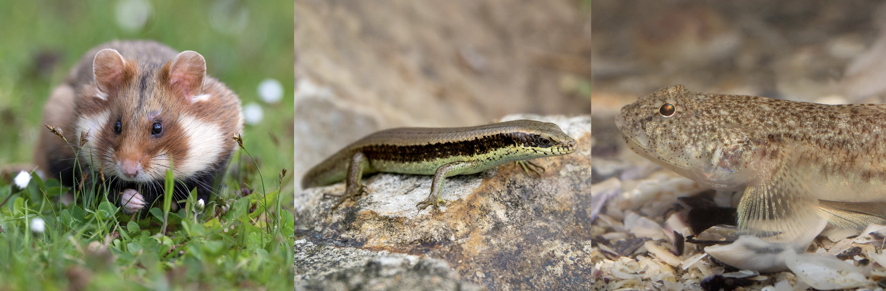
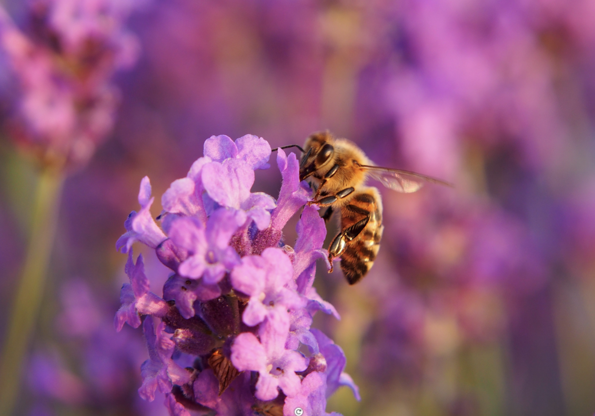
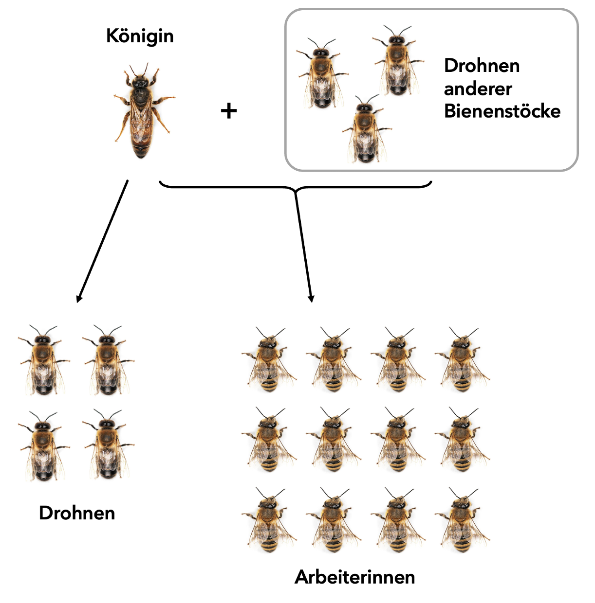

# Soziale Interaktionen im Tierreich {#Sozialverhalten}

**Am Ende des letzten Kapitels haben wir uns die Frage gestellt, warum Erdmännchen Wache stehen und haben dabei ultimate und proximate Erklärungsansätze verglichen. Was bei diesem Verhalten auffällt, ist, dass es in einem kooperativen Kontext vonstatten geht. In diesem Kapitel werden wir uns vertieft mit dem Sozialverhalten im Tierreich auseinandersetzen und zwei Arten davon genauer unter die Lupe nehmen: der egoistische Kannibalismus und das altruistische Verhalten im Bienenstock. **

 

>**Lernziele**
>
>- Sie können die Konzepte «Infantizid» und «Altruismus» aus biologischer Perspektive ohne Hilfsmittel in einem Satz definieren. 
>
>-	Sie können unter Einbezug der Evolutionstheorie eine Kosten-Nutzen-Analyse durchführen, um tierisches Verhalten an einem Beispiel zu erklären. 
>
>-	Sie können auf Basis der Verwandtschaftsverhältnisse im Bienenstock evolutionäre Vorteile altruistischen Verhaltens beurteilen und in 2-3 Sätzen zusammenfassen.
>
>-	Sie können erläutern, inwiefern die biologische Definition von Altruismus für komplexe Systeme ausreichend ist.

## Kannibalismus in den eigenen vier Wänden

Im Folgenden befassen wir uns mit dem intraspezifischen Kannibalismus, genauer dem Infantizid, also dem Töten (und Fressen) von Nachkommen der gleichen Art. Das Verhalten, das für uns Menschen so unvorstellbar ist, kommt im Tierreich überraschenderweise gar nicht so selten vor. Möglichen Gründen dafür werden wir mit drei Beispielen aus dem Tierreich auf den Grund gehen (Abb. \@ref(fig:fig5-1)). Lesen Sie diese durch und beantworten Sie die dazugehörigen Antworten unten. 

(\#fig:fig5-1)Infantizid wurde beim Feldhamster (links), der Echsenart _Eutropis longicaudata_ (Mitte) und der Sandgrundel (rechts) gefunden. 

### Hamster und deren Nachkommen {.unnumbered}

Hamster-Weibchen zeigen ein auffallendes Verhalten in Abhängigkeit der Grösse ihres Wurfs. So wurde gezeigt, dass Weibchen bei Würfen von acht oder neun Jungen regelmässig zwei von ihnen fressen. Als dann zwei zusätzliche Junge in einen bestehenden Wurf eingebracht wurden, frass die Mutter insgesamt vier Hamsterjunge. Wenn hingegen einige Junge direkt nach der Geburt entfernt wurden, konnte kein Kannibalismus beobachtet werden. Zusätzlich wurde beobachtet, dass die Auswahl der Jungen, die gefressen werden, offenbar gezielt erfolgt. Es scheint, als ob die Mutter die schwächsten oder kleinsten Neugeborenen wählt.

### Raubtiergefahren für _Eutropis longicaudata_ {.unnumbered}
Die Echsenart _Eutropis longicaudata_ zeigt in Situationen starker Bedrohung ein aussergewöhnliches Verhalten: Wenn sich wiederholt Raubtiere ihren Eiern nähern, frisst die Mutter ihre eigenen Eier. Verhaltensstudienstudien haben gezeigt, dass dieses Verhalten vor allem dann ausgelöst wird, wenn die Bedrohung mehrfach und in kurzen Abständen erfolgt. Zusätzlich zu den direkten Beobachtungen des Verhaltens wurde ersichtlich, dass dieses Verhalten häufig in Situationen auftritt, in denen die Mutter bereits schwach ist oder in einem Lebensraum lebt, der ständigen Bedrohungen durch Fressfeinde ausgesetzt ist.

### Kannibalismus der Sandgrundel {.unnumbered}

Das Sandgrundel-Männchen bewacht die Eier, die von mehreren Weibchen in seinem Nest abgelegt wurden. Studien zeigen, dass es die Eier regelmässig überprüft und unter bestimmten Bedingungen jene frisst, die sich langsamer entwickeln. Durch das gezielte Entfernen dieser Eier kann sich das Männchen erneut paaren. Beobachtungen während der Experimente zeigen zudem, dass das Männchen einen erheblichen Energieaufwand in die Bewachung seines Nests investiert.

 

◑ **Aufgabe 1.** Ordnen Sie folgende Aussage ein: «Kannibalismus von eigenen Kindern im Tierreich lässt auf ein egoistisches Verhalten bestimmter Individuen schliessen.» Stimmen Sie dem zu oder nicht? Begründen Sie Ihre Antwort.

● **Aufgabe 2.** Was sind mögliche evolutionäre Konsequenzen dieses Infantizid-Verhaltens auf das Überleben der Population?

◑ **Aufgabe 3.** Erstellen Sie eine Kosten-Nutzen-Analyse für eines der drei Beispiele oben.

 

<a href="javascript:void(0);" onclick="toggleIframe()" style="
  display: inline-block;
  padding: 10px 20px;
  font-size: 16px;
  background-color: #404f58;
  color: white;
  border-radius: 5px;
  text-decoration: none;
">→ Antworten mit KI überprüfen</a>

  <iframe src="https://stobler.shinyapps.io/verhaltensbiologie" width="100%" height="600px" style="border: 1px solid #ccc;"></iframe>

## Altruismus im Bienenstock

Im Gegensatz zum Infantizid sind beim altruistischen Verhalten nicht unmittelbar direkte evolutionäre Vorteile für die eigene Fitness erkennbar. In der Biologie wird Altruismus als ein Verhalten definiert, bei dem das empfangende Individuum im Sinne der biologischen Fitness profitiert, während für das gebende Individuum ein Nachteil entsteht, unabhängig von Intention, moralischer Bewertung oder Auswirkungen auf Dritte. Im Folgenden richten wir den Fokus auf den Altruismus bei Honigbienen, bei denen dieses Verhalten besonders deutlich beobachtet werden kann.

### Der Bienenstock – eine Grossfamilie {.unnumbered}

Ein Bienenstock besteht während der Hauptsaison normalerweise aus ungefähr 30’000 bis 40’000 Individuen, die meisten davon Arbeiterinnen – weibliche Bienen, die für die Aufzucht der Jungen oder das Sammeln von Pollen und Nektar verantwortlich sind (Abb. \@ref(fig:fig5-2)). Neben den Arbeiterinnen leben auch eine Königin sowie männliche Bienen, die Drohnen, im Bienenstock. Drohnen sind jedoch nur während der Fortpflanzungssaison anwesend.

(\#fig:fig5-2)Honigbiene an Lavendelblüte.

Die Arbeiterinnen, sind genetisch betrachtet (Halb-)Schwestern, da sie von derselben Königin abstammen. Sie können allerdings unterschiedliche Väter haben, da die Königin typischerweise Nachkommen von durchschnittlich zwölf Drohnen zeugt. Dadurch sinkt der Verwandtschaftsgrad zwischen den Arbeiterinnen im Vergleich zur Königin und folglich unterstützen die Arbeiterinnen eher die Königin als ihre Schwestern, um die Weitergabe des eigenen Erbguts zu fördern.

Die Königin legt befruchtete und unbefruchtete Eier (Abb. \@ref(fig:fig5-3)). Die befruchteten Eier entwickeln sich zu diploiden Arbeiterinnen oder, unter besonderen Bedingungen, zu neuen Königinnen, während die unbefruchteten Eier zu Drohnen heranwachsen. Da Drohnen aus den unbefruchteten Eiern entstehen, besitzen sie nur genomisches Material der Mutter. Sie sind also haploid und besitzen nur einen einfachen Chromosomensatz.

(\#fig:fig5-3)Verwandtschaftsverhältnisse der Honigbiene.

Aufgrund dieser Unterschiede in der Anzahl Chromosomensätze der Nachkommen der Bienenkönigin ist die Abschätzung des Verwandtschaftsgrades im Bienenstock alles andere als trivial. Der Verwandtschaftsgrad wird durch den Verwandtschaftskoeffizienten dargestellt und zeigt an, wie eng zwei Individuen genetisch verwandt sind – also wie viel Prozent ihrer Gene sie im Durchschnitt gemeinsam haben, weil sie sie von einem gemeinsamen Vorfahren geerbt haben. Es ist also die Wahrscheinlichkeit, dass zwei Individuen aufgrund ihrer Abstammung ein bestimmtes Allel teilen. 

Ein einfaches Beispiel ist der Verwandtschaftsgrad zwischen Ihnen und einem Ihrer Elternteile, der $r = 0.5$ beträgt. 50% Ihrer Gene lassen sich in diesem Elternteil wiederfinden. Aber auch der Verwandtschaftsgrad zwischen Ihnen und Ihrer Schwester wäre 50%. Die mathematische Berechnung von Verwandtschaftsgraden wird deutlich komplexer, sobald Verwandtschaftsbeziehungen betrachtet werden, die über Eltern und Nachkommen hinausgehen, oder wenn es sich nicht mehr um diploide Organismen handelt, wie dies bei Bienen der Fall ist.

Eine mathematische Aufarbeitung ist im Zusatzkapitel (Kapitel 7) dargestellt. Bei Interesse können Sie diese freiwillig und selbstständig erarbeiten. Für das Verständnis der biologischen Zusammenhänge in diesem Kapitel ist es jedoch zentral, die Verwandtschaftsgrade im Bienenstock zu kennen, und auch zu erkennen, dass viele biologische Konzepte ohne mathematische Grundlagen nicht vollständig nachvollziehbar sind. Die Biologie stützt sich in vielen Bereichen auf präzise Berechnungen, Modelle und Wahrscheinlichkeiten, insbesondere wenn es um Verwandtschaft, Vererbung oder Evolution geht.

Die Verwandtschaftskoeffizienten innerhalb eines Bienenstocks variieren stark, abhängig davon, ob die Tiere haploid oder diploid sind und ob sie vom selben Vater abstammen. Die Tabelle \@ref(tab:tab5-1) fasst diese für die unterschiedlichen Beziehungen zusammen.

Wenn wir die Verwandtschaftskoeffizienten der Arbeiterinnen genauer anschauen, stellt man fest, dass der Wert r für Vollschwestern (Arbeiterinnen mit gleichem Vater) höher ist, als zu den eigenen (theoretischen) Nachkommen In diesem Fall wäre nämlich $r = 0.5$. Aus evolutionärer Perspektive gelingt also das Fördern der eigenen Gene eher, wenn in den Reproduktionserfolg der Schwestern investiert wird, welche sich zu neuen Königinnen entwickeln können.

 

Table: (\#tab:tab5-1) Verwandtschaftskoeffizienten bei Honigbienen.

| Verwandtschaft          | Bienenkönigin (Mutter) | Drohne (Vater) | Arbeiterin (Nachkomme) mit gleichem Vater | Arbeiterin (Nachkomme) mit unterschiedlichem Vater |
|-------------------------|------------------------|----------------|--------------------------------------|------------------------------------------------|
| Drohne (Nachkomme)           | *r* = 1                | –              | *r* = 0.5                            | *r* = 0.5                                      |
| Arbeiterin (Nachkomme)       | *r* = 0.5              | *r* = 1        | *r* = 0.75                           | *r* = 0.25                                     |

 

Anmerkung: Verwandtschaftsgrad von Arbeiterinnen bei mehrfach gepaarten Königinnen

In vielen Darstellungen zur Verwandtenselektion wird für Arbeiterinnen ein Verwandtschaftsgrad von $r = 0.75$ verwendet. Dieser Wert gilt jedoch nur für Vollschwestern, also Arbeiterinnen mit derselben Mutter und demselben Vater. Wenn man davon ausgeht, dass nur jede zwölfte Arbeiterin den gleichen Vater hat, dann läge der resultierende Verwandtschaftskoeffizient zwischen allen Arbeiterinnen in einem Bienenstock bei etwas mehr als $r = 0.29$, also deutlich tiefer als der zwischen Arbeiterin und Königin. 

### Die Arbeit als Wächterin {.unnumbered}

Im Bienenstock übernehmen spezialisierte Arbeiterinnen die Rolle der Wächterinnen, um die Kolonie vor Eindringlingen wie Wespen, Räubern oder anderen Bienen zu schützen (Abb. \@ref(fig:fig5-4)). Diese Wächterinnen postieren sich am Eingang des Stocks und prüfen anhand des Duftes der ankommenden Bienen, ob dieser zur eigenen Kolonie gehört. Im Falle eines Angriffs verteidigen sie den Stock entschlossen, oft unter Einsatz ihres Lebens. Da der Stachel von Honigbienen Widerhaken besitzt, bleibt er beim Stechen in elastischer Haut, etwa der von Säugetieren, stecken, was zum Tod der Biene führt. Bei Angreifern mit einem harten Aussenskelett, wie anderen Insekten, kann der Stachel hingegen meist wieder herausgezogen werden, sodass die Biene überlebt.

(\#fig:fig5-4)Der Bienenstock. 

 

○ **Aufgabe 4.** Erklären Sie in eigenen Worten, welche Rolle der Verwandtschaftsgrad im Kontext biologisch altruistischen Verhaltens spielt. Beziehen Sie sich auf die Situation im Bienenstock.

◑ **Aufgabe 5.** Der Einsatz der Wächterinnen endet oft tödlich – die Kosten könnten also kaum höher sein. Erläutern Sie mögliche evolutionäre Vorteile dieses Verhaltens unter Berücksichtigung des Optimalitätsprinzips.

◑ **Aufgabe 6.** Überlegen Sie, von welchen Faktoren die individuelle Fitness im evolutionären Sinn abhängt. Diskutieren Sie, wie das altruistische Verhalten der Arbeiterinnen die Weitergabe ihrer Gene indirekt fördern kann.

● **Aufgabe 7.** Bei Honigbienen hemmen Pheromone der Königin die Entwicklung der Eierstöcke der Arbeiterinnen, wodurch diese sich nicht fortpflanzen können. Stattdessen übernehmen sie Aufgaben wie Pflege und Nahrungssuche. Erklären Sie, weshalb dieses Verhalten biologisch gesehen als altruistisch gilt und diskutieren Sie, ob man für solche Fälle die biologische Definition anpassen sollte. 

 

<a href="javascript:void(0);" onclick="toggleIframe2()" style="
  display: inline-block;
  padding: 10px 20px;
  font-size: 16px;
  background-color: #404f58;
  color: white;
  border-radius: 5px;
  text-decoration: none;
">→ Antworten mit KI überprüfen</a>

  <iframe src="https://stobler.shinyapps.io/verhaltensbiologie" width="100%" height="600px" style="border: 1px solid #ccc;"></iframe>

## Reflexion des sozialen Verhaltens

Unsere alltägliche Definition von Altruismus unterscheidet sich von der in der Biologie. Im Alltag bezeichnen wir als altruistisches Verhalten in der Regel ein selbstloses, uneigennütziges Handeln, das einem anderen Individuum einen Vorteil verschafft, einem selbst aber einen Nachteil. Ob es gemäss dieser Perspektive tatsächlich altruistisches Verhalten gibt, wird dann schnell zu einer philosophischen Fragestellung (Abb. \@ref(fig:fig5-5)).

Im biologischen Kontext ist Altruismus wertfrei definiert und nicht mit selbstlosem Handeln gleichzusetzen. Als altruistisch gilt ein Verhalten, das die eigene Fitness verringert, gleichzeitig aber die Fitness eines anderen Individuums erhöht, unabhängig von Absicht, Motivation oder moralischer Bewertung.

Exkurs: Reziproker Altruismus

Neben Verwandtschaft kann altruistisches Verhalten auch zwischen nicht verwandten Individuen auftreten. In diesem Fall spricht man von reziprokem Altruismus. Dabei nimmt ein Individuum kurzfristige Kosten in Kauf, wenn die Wahrscheinlichkeit besteht, dass das begünstigte Individuum in einer späteren Situation ebenfalls kooperiert. Voraussetzung dafür sind wiederholte Interaktionen, die Fähigkeit zur Wiedererkennung sowie eine gewisse Stabilität der sozialen Gruppe.

Ein Beispiel dazu wäre, wenn eine Schülerin einem Mitschüler erlaubt, ihre Hausaufgaben abzuschreiben und dafür kurzfristig einen Nachteil oder ein Risiko in Kauf nimmt, in der Erwartung, bei einer späteren Gelegenheit ebenfalls Unterstützung zu erhalten.

Reziproker Altruismus stellt dabei nur einen von mehreren möglichen Mechanismen dar, durch die altruistisches Verhalten evolutionär stabilisiert werden kann.

 

<iframe width="560" height="315" src="https://www.youtube.com/embed/DowJfUmlzeI?si=ru4wiYrqu0UMfqB0" title="YouTube video player" frameborder="0" allow="accelerometer; autoplay; clipboard-write; encrypted-media; gyroscope; picture-in-picture; web-share" referrerpolicy="strict-origin-when-cross-origin" allowfullscreen></iframe>

(\#fig:fig5-5)Moralische Aspekte unseres alltäglichen Altruismus-Verständnisses können zu Diskussionen führen. 

◑ **Aufgabe 8.** Erdmännchen wechseln sich beim Wachehalten ab, indem jeweils ein Tier erhöht steht, aufmerksam die Umgebung beobachtet und bei Gefahr durch spezifische Laute die Gruppe warnt. Analysieren Sie, inwiefern dieses Verhalten von Erdmännchen als biologisch altruistisch gewertet werden kann und ob es auch auf Ihre Definition in Aufgabe 7 (Kapitel 5) passt.

● **Aufgabe 9.** Diskutieren Sie, wie sich Altruismus (neben dem reziproken Altruismus) durch die Evolution stabilisiert haben könnte, obwohl altruistisches Verhalten per Definition die individuelle Fitness des handelnden Individuums senkt.

 

<a href="javascript:void(0);" onclick="toggleIframe3()" style="
  display: inline-block;
  padding: 10px 20px;
  font-size: 16px;
  background-color: #404f58;
  color: white;
  border-radius: 5px;
  text-decoration: none;
">→ Antworten mit KI überprüfen</a>

  <iframe src="https://stobler.shinyapps.io/verhaltensbiologie" width="100%" height="600px" style="border: 1px solid #ccc;"></iframe>

## Mastery Check

**Aufgabe 10 | Mastery Check.** Lösen Sie die Multiple Choice-Aufgaben zu diesem Kapitel, die Sie unter dem folgenden Link finden. Wenn Sie mehr als 80% der Punkte erreichen, können Sie mit dem nächsten Kapitel fortfahren. Zeigen Sie vorher Ihre Ergebnisse des Mastery Checks kurz der Lehrperson.

 

<a href="https://forms.gle/CXUyv94j2xq59G9p6" download style="
  display: inline-block;
  padding: 10px 20px;
  font-size: 16px;
  background-color: #404f58;
  color: white;
  border-radius: 5px;
  text-decoration: none;
">
→ Mastery Check: Kapitel 5
</a>
