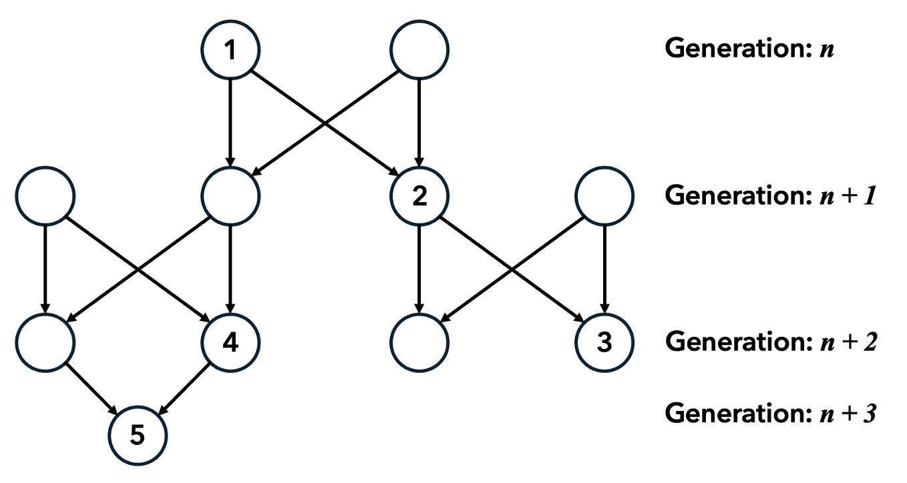
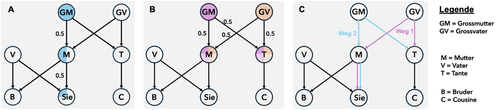
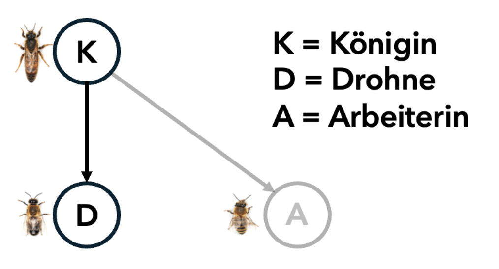

# Additum: Mathematische Aufarbeitung des Verwandtschaftskoeffizienten {#Zusatzkapitel}

**Sind die Abstammungsverhältnisse von sich sexuell fortpflanzenden Organismen bekannt, kann der Verwandtschaftsgrad und damit der Verwandtschaftskoeffizient r bestimmt werden. Aufgrund der Komplexität des Themas werden im folgenden Anhang die Verwandtschaftskoeffizienten und -verhältnisse schrittweise im Bienenstock berechnet.**

 

>**Lernziele**
>
>-	Sie können die mathematische Formel zur Berechnung des Verwandtschaftskoeffizienten und deren Variablen in eigenen Worten erklären. 
>
>-	Sie können den Verwandtschaftsgrad zweier Individuen bei vorgegebener Ploidität und Verwandtschaft mithilfe der Formel berechnen. 
>
>-	Sie können die Nützlichkeit solcher Formeln für biologische Systeme mit sozialem Verhalten kritisch reflektieren und Ihre Überlegungen in wenigen Sätzen zusammenfassen.

## Verwandtschaftsgrad berechnen 

Der Verwandtschaftskoeffizient gibt die Wahrscheinlichkeit an, mit der ein Lebewesen aufgrund seiner Abstammung von seinen Vorfahren ein bestimmtes Allel besitzt. Graphisch lassen sich die Verwandtschaftsverhältnisse wie in Abb. \@ref(fig:fig7-1) darstellen.

(\#fig:fig7-1)Verwandtschaftsverhältnisse über vier Generationen.

Kreise entsprechen dabei einzelnen Individuen und Pfeile geben die Abstammungsrichtung an. Da der Entstehung der Gameten eine Meiose (Reifeteilung) vorangeht, ist die Wahrscheinlichkeit für ein Allel, in eines der Kinder zu kommen, 0.5 oder 50%. Wenn das Allel über mehrere Generationen $n$ weitergegeben wird, so halbiert sich die Wahrscheinlichkeit für jede Generation. 

Der Verwandtschaftskoeffizient lässt sich demnach wie folgt berechnen: Die Wahrscheinlichkeit eines Allels aufgrund von Verwandtschaftsverhältnissen in zwei Individuen vorhanden zu sein, ist $r=(0.5)^n$. Gibt es mehrere Wege, von einem Individuum zum anderen zu kommen, summieren sich diese Wahrscheinlichkeiten.

**Beispiel:** $r$ für Individuen 1 und 3: Nur 1 Weg ist möglich und 2 Schritte sind nötig. Daher ist $r=(0.5)^2=0.25$. Die Wahrscheinlichkeit, dass der Enkel ein bestimmtes Allel des Grossvaters besitzt, ist also 25%. 

 

○ **Aufgabe 1.** Erklären Sie die Formel $r=(0.5)^n$ in eigenen Worten. 

◑ **Aufgabe 2.** Berechnen Sie $r$ für Individuen 2 und 4, sowie Individuen 3 und 4. 

 

<a href="javascript:void(0);" onclick="toggleIframe()" style="
  display: inline-block;
  padding: 10px 20px;
  font-size: 16px;
  background-color: #404f58;
  color: white;
  border-radius: 5px;
  text-decoration: none;
">→ Antworten mit KI überprüfen</a>

  <iframe src="https://stobler.shinyapps.io/verhaltensbiologie" width="100%" height="600px" style="border: 1px solid #ccc;"></iframe>

## Der Verwandtschaftsgrad diploider Organismen

Für diploide Organismen, die sich sexuell fortpflanzen, kann der Verwandtschaftsgrad durch den Verwandtschaftskoeffizienten $r$ anhand der Formel $r=(0.5)^n$ berechnet werden, wobei $n$ die Anzahl Generationen darstellt, die zwischen zwei Individuen mit gemeinsamer Abstammung liegen. Zudem rechnen wir mit dem Faktor 0.5, da in diploiden Organismen nur die Hälfte des Genoms von einem Elternteil vererbt wird. Welche Merkmalsausprägungen (resp. welches Set an Chromosomen) vererbt werden, wird zufällig in der Meiose entschieden. 

Im Folgenden werden wir einen vereinfachten Stammbaum einer fiktiven Familie betrachten. Ihre Aufgabe ist es, diese Beispiele genau durchzuarbeiten. Melden Sie sich bei Fragen bei der Lehrperson. 

(\#fig:fig7-2)Verschiedene Verwandtschaftsgrad-Berechnungen in einem fiktiven Familienstammbaum.

 

**Beispiel 1: Verwandtschaftsgrad zwischen Ihnen und Ihrer Grossmutter mütterlicherseits (Abb. \@ref(fig:fig7-2) links)**

Ihre Mutter hat 50% ihres Erbguts von ihrer Mutter erhalten, die anderen 50% von ihrem Vater, also ihrem Grossvater. Somit ist Ihre Mutter also genetisch gesehen eine Mischung aus Ihren Grosseltern. Der Verwandtschaftsgrad zu ihrer Mutter ist 50% und der zu ihrem Vater ebenfalls. Diese Überlegung stimmt auch mit der Formel überein: $r=(0.5)^n$ wobei $n= 1$ ist, da wir nur eine Generation zurück gegangen sind. $r$ ist also $(0.5)^1$ und somit 0.5 oder 50%. 

Da Sie 50% Ihres eigenen Erbguts von der eigenen Mutter haben und Ihre Mutter wiederum 50% ihres Erbguts von Ihrer Grossmutter, kommt die Hälfte des Erbguts, das von Ihrer Mutter kommt, tatsächlich von Ihrer Grossmutter. 50% von 50% ist dabei 25% ($1/2*1/2=1/2^2 =0.25$) und damit sind wir wieder bei der Formel $(0.5)^n=r$ mit $n=2$ Generationen. $r=0.25$ macht auch intuitiv Sinn, wenn Sie bedenken, dass Sie vier Grosseltern haben. Von jedem Grosselternteil kommt also ein Viertel Ihres Genoms zusammen.

 

**Beispiel 2: Verwandtschaftsgrad zwischen Ihrer Mutter und Ihrer Tante (Abb. \@ref(fig:fig7-2) Mitte)**

Ihre Mutter hat 50% ihres Erbguts von Ihrer Grossmutter und 50% vom Grossvater, genau gleich also wie Ihre Tante. Da aufgrund der Meiose 50% der Gene weitergegeben werden, es aber zufällig ist, welche Gene weitergegeben werden, haben Ihre Mutter und Ihre Tante wiederum eine 50-prozentige Chance, die gleichen Gene von ihrer Mutter zu erhalten. Wir haben eine 50-prozentige Chance, da wir diploid sind. Es ist also wie ein Münzwurf, der entscheidet, welche Chromosomen des Genoms weitergegeben werden. 

Für die Vererbung der gleichen Gene Ihrer Grossmutter an Ihre Mutter und Tante berechnet sich daher die Wahrscheinlichkeit wieder $0.5*0.5=(0.5)^2=0.25$. Das gleiche gilt dabei auch für Gene Ihres Grossvaters. 25% der Gene sind im Durchschnitt in Ihrer Mutter und Tante vorhanden. Zusammen ergibt das also 50% genetische Übereinstimmung. 

Wenn wir wieder die Verbindungen (Generationenschritte) betrachten, kommen wir für den Grossvater und die Grossmutter wieder jeweils auf das gleiche Resultat: mit zwei Schritten (1x zum Elternteil, 1x zur Schwester) ergibt das $(0.5)^2=r$ (Grossmutter)  und $(0.5)^2=r$ Grossvater. Da Gene von beiden vererbt werden, ergibt die Summe davon $(0.5)^2+(0.5)^2=0.5=r$.  

 

**Beispiel 3: Verwandtschaftsgrad zwischen Ihnen und Ihrer Tante (Abb. \@ref(fig:fig7-2) rechts)**

Wenn Sie 50% Ihres Genoms von Ihrer Mutter haben, und diese 50% ihres Genoms mit ihrer Schwester, also Ihrer Tante teilt, so stimmt Ihr Genom zu 25% mit dem Genom Ihrer Tante überein.

Sobald man diese Schritte allerdings für entferntere Verwandte machen muss, kann es schnell sehr mühsam werden. Deshalb hilft auch hier die Formel $r=(0.5)^n$. In diesem Beispiel lässt sich nämlich der Weg der Gene von Ihrer Tante zu Ihnen nachverfolgen, einmal über Ihre Grossmutter und einmal über Ihren Grossvater. Wir haben also 2 Wege mit je 3 Generationen, die überwunden werden. Mit unserer Formel ergibt das $r=(0.5)^3+(0.5)^3=0.125+0.125$ → $r=0.25$. Wir kommen wieder auf dasselbe Resultat, allerdings etwas schneller.

 

◑ **Aufgabe 3.** Berechnen Sie den Verwandtschaftsgrad zwischen Ihnen und Ihrem Cousin. 

 

<a href="javascript:void(0);" onclick="toggleIframe2()" style="
  display: inline-block;
  padding: 10px 20px;
  font-size: 16px;
  background-color: #404f58;
  color: white;
  border-radius: 5px;
  text-decoration: none;
">→ Antworten mit KI überprüfen</a>

  <iframe src="https://stobler.shinyapps.io/verhaltensbiologie" width="100%" height="600px" style="border: 1px solid #ccc;"></iframe>

## Der Verwandtschaftskoeffizient – eine erste Erweiterung

Wir haben also gesehen, dass die Formel $r=(0.5)^n$ sehr praktisch sein kann, um zu berechnen, wie nah zwei Individuen miteinander verwandt sind. Dies funktioniert allerdings nur so einfach, wenn die Verbindung direkt gemacht wird. Sobald man in der Generationenebene zurück muss, wie beispielsweise über die Grosseltern, um das Verhältnis Nichte-Tante zu beobachten, genügt die Formel nicht mehr. In diesem Fall muss man den Koeffizienten für jeden möglichen Weg berechnen. Daraus ergibt sich also: 	

$r = 0.5^n \tag{7.1}$

wenn nur direkte Verwandtschaften vorkommen und

$r = \sum_{i=1}^{k} 0.5^{n_i} \tag{7.2}$

wenn direkte und indirekte Verwandtschaften (also nur in eine Richtung laufend oder via Weg über einen Vorfahren) vorkommen. Dabei ist $k$ die maximale Anzahl Varianten oder Wege, über welche man im Stammbaum vom einen zum anderen Individuum gelangen kann, und $n_i$ die Anzahl Generationsschritte, mit welcher man in Variante $i$ von einem Individuum zum anderen gelangt. 

Diese Formel berücksichtigt, dass zwei Individuen über mehrere mögliche Wege im Stammbaum miteinander verwandt sein können. Jeder dieser Wege trägt einen Teil zum gesamten Verwandtschaftsgrad bei und wird deshalb separat berechnet und anschliessend addiert (siehe auch Abb. \@ref(fig:fig7-2)C im vorherigen Kapitel).

 

**Beispiel 1: Verwandtschaftsgrad zwischen Ihnen und Ihrer Grossmutter mütterlicherseits**

Wir gehen im Stammbaum immer nur in eine Richtung, weshalb eine direkte Verwandtschaft vorherrscht. Es sind zwei Generationen (die erste zu Ihrer Mutter, die zweite zu Ihnen), weshalb $n=2$ ist. Dadurch ergibt sich mit Formel 7.1: $r=(0.5)^2$.

 

**Beispiel 2: Verwandtschaftsgrad zwischen Ihrer Mutter und Ihrer Tante**

Um den Verwandtschaftsgrad Ihrer Mutter und Tante zu bestimmen, muss die Generation gewechselt werden: Zur Grossmutter oder zum Grossvater und wieder zurück. Deshalb ist hier eine indirekte Verwandtschaft vorhanden und Formel 7.2 wird gebraucht. Da man die Verwandtschaft auf zwei Arten erklären kann, via Grossmutter oder Grossvater, ist also $k=2$. Bei beiden Varianten sind es 2 Generationsschritte $(n_1=n_2=2)$, woraus folgt, dass $r=(0.5)^{n_1}+(0.5)^{n_2}=(0.5)^2+(0.5)^2$ und daher $r=2*(0.5)^2=2*0.25=0.5$.

 

**Beispiel 3: Verwandtschaftsgrad zwischen Ihnen und Ihrer Tante**

Auch hier kann der Stammbaum zeitlich nicht nur in eine Richtung gelesen werden. Man kommt von Ihnen zur Tante entweder via Grossvater oder Grossmutter. Da dies, im Gegensatz zum Beispiel 2 mit Ihrer Mutter, ein Schritt mehr beinhaltet, ist also $n_i=n_2=3$ und somit $r=(0.5)^3+(0.5)^3=0.25$.

 

◑ **Aufgabe 4.** Berechnen Sie den Verwandtschaftsgrad zwischen Ihnen und Ihrem Cousin mit der neuen Formel. 

● **Aufgabe 5.** In der Formel 7.2 wird der Faktor 0.5 gebraucht, um den Verwandtschaftsgrad zu berechnen. Erklären Sie in eigenen Worten, warum wir bis anhin mit 0.5 gerechnet haben, und wann dies nicht mehr funktioniert. 

 

<a href="javascript:void(0);" onclick="toggleIframe3()" style="
  display: inline-block;
  padding: 10px 20px;
  font-size: 16px;
  background-color: #404f58;
  color: white;
  border-radius: 5px;
  text-decoration: none;
">→ Antworten mit KI überprüfen</a>

  <iframe src="https://stobler.shinyapps.io/verhaltensbiologie" width="100%" height="600px" style="border: 1px solid #ccc;"></iframe>

## Der Verwandtschaftskoeffizient – eine zweite Erweiterung 

Wie wir im vorherigen Kapitel gesehen haben, gilt diese Formel für diploide Organismen. Deshalb ist auch der multiplizierte Faktor 0.5. Nur die Hälfte des Genoms wird an die nächste Generation vererbt. Anders sieht es allerdings aus, wenn wir nicht mehr diploide, sondern haploide Organismen betrachten. 

Im einfachsten Fall stammt also das haploide Kind von einem haploiden Elternteil ab, welches ebenfalls von einem haploiden Elternteil abstammt. Da in diesem Fall keine Meiose stattfindet, erben alle Kinder das gleiche Erbgut wie die jeweiligen Eltern, welche ebenfalls das komplette Genom ihrer Eltern geerbt haben. Man hat also eine Klonierung haploider Organismen. 

Die Verwandtschaftsverhältnisse sind intuitiv klar: man hat einen Verwandtschaftsgrad von 100%, da die Kindsgeneration die exakt gleichen Gene trägt. Mathematisch kann man hingegen die Formeln nicht mehr anwenden. Um eine allgemeingültige Formel zu erhalten, müssen wir daher Formel 7.2 (als allgemeinere Form der Formel 7.1) entsprechend anpassen: 

$r = \sum_{i=1}^{k} P^{n_i} \tag{7.3}$

mit $P$ als den Kehrwert des Ploidiegrads (Anzahl vorhandener Chromosomensätze) der zu untersuchenden Individuen von einer bestimmten Abstammung.

Für den Verwandtschaftsgrad im haploiden Beispiel ergibt sich folglich vom Grosselternteil zu Elternteil $r=1^1=1$, da $P=1$ und $n=1$ Generation; für den Verwandtschaftsgrad von Elternteil zu Enkelkind ergibt sich $r=1^2=1$ mit $n =2$ Generationsschritte. Dass das Resultat das gleiche ist, macht ebenfalls Sinn, da es sich um Klone handelt. 

Die ursprünglich eingeführte Formel 7.2 erlaubt daher zwar in simplen Beispielen den Verwandtschaftsgrad zwischen zwei Individuen zu berechnen, stösst allerdings ziemlich schnell an ihre Grenzen, wenn auf mehr als nur eine Art die Verwandtschaft erklärt werden kann oder wenn die Individuen nicht diploid sind. Die allgemeingültigere Formel 7.3 für den Verwandtschaftsgrad (oder Verwandtschaftskoeffizienten) muss deshalb angepasst werden; mit $r$ als Verwandtschaftskoeffizienten, $k$ als maximale Anzahl Wege, um Verwandtschaft zu erklären, $n_i$ als Anzahl Generationsschritte eines Weges $i$, und $P$ als den Kehrwert des Ploidiegrades, mit $P=1$ bei haploiden und $P=0.5$ bei diploiden Organismen.

Mithilfe der erarbeiteten Formeln können nun die Verwandtschaftsverhältnisse auch in komplexeren Systemen wie dem Bienenstock betrachtet werden. Im Bienenstock gibt es folgende Bienen: 

- Königin: diploid, legt unbefruchtete und befruchtete Eier

- Arbeiterinnen: diploid, aus befruchteten Eiern der Königin

- Drohnen: männliche Bienen, haploid, aus unbefruchteten Eiern der Königin

Was in allen Tieren gleich ist, ist, dass die Königin durch Meiose haploide Eier produziert. Worin sich allerdings die Honigbiene von vielen anderen Tieren unterscheidet, ist, dass sie entweder diese Eier unbefruchtet legen kann, woraus schlussendlich die Drohnen schlüpfen, oder befruchtet legen kann, woraus Arbeiterinnen schlüpfen.  

 

◑ **Aufgabe 6.** Berechnen Sie den Verwandtschaftsgrad einer Arbeiterin und einer Drohne mit der Königin. Nehmen Sie sich dazu die Abbildung \@ref(fig:fig7-3) zu Hilfe. 
 
 

(\#fig:fig7-3)Abstammungsverhältnisse im Bienenstock.

● **Aufgabe 7.** Vor welchem Problem stehen wir, wenn wir herausfinden möchten, wie hoch der Verwandtschaftsgrad zwischen einer Drohne und einer Arbeiterin mit der gleichen Königin als Mutter ist?

 

<a href="javascript:void(0);" onclick="toggleIframe4()" style="
  display: inline-block;
  padding: 10px 20px;
  font-size: 16px;
  background-color: #404f58;
  color: white;
  border-radius: 5px;
  text-decoration: none;
">→ Antworten mit KI überprüfen</a>

  <iframe src="https://stobler.shinyapps.io/verhaltensbiologie" width="100%" height="600px" style="border: 1px solid #ccc;"></iframe>

## Der Verwandtschaftskoeffizient – eine dritte und letzte Erweiterung 

Um der Situation gerecht zu werden, dass nicht alle Generationswege $n_i$ den gleichen Ploidiegrad $P$ haben müssen, muss also unsere Formel entsprechend angepasst werden. Als Beispiel der Drohnen und Arbeiterinnen derselben Mutter kann man schliessen, dass die Drohnen zwar mit der Mutter einen Verwandtschaftsgrad von $r=1$ haben und die Arbeiterinnen mit der Mutter $r=0.5$. Wenn in beiden Schritten diploide Individuen vorkämen, dann ginge die Formel mit $r$ als das Multiplikationsprodukt der beiden Wahrscheinlichkeiten auf ($r=0.5*0.5=(0.5)^2$). 

Da wir aber nun einen Ploidiewechsel in den zwei Generationsschritten ($n=2$) haben, entsteht in unserer Formel ein Widerspruch $r=1*0.5 ≠(0.5)^n=(0.5)^2$. Viel eher müsste man also das Produkt der Einzelwahrscheinlichkeiten (d.h. der Ploidiegrade) der einzelnen Schritte betrachten. Die angepasste Formel lautete daher: 

$r = \sum_{i=1}^{k} \left( \prod_{j=1}^{n} P_{i,j} \right) \tag{7.4}$

mit 

- $r$ als Verwandtschaftskoeffizienten

- $k$ als maximale Anzahl Wege $i$, um Verwandtschaft zu erklären

- $n$ als maximale Anzahl Generationen aus $j$ Generationsschritten

- $P_{(i,j)}$ als Ploidiegrad des Schrittes j auf dem Weg $i$ mit $P_{(i,j)}=1$ bei Schritten haploider Organismen und $P_{(i,j)}=0.5$ bei Schritten von diploiden Organismen. 

Die Überlegungen aus dem vorherigen Kapitel bezüglich der Anzahl Wege, um die Verwandtschaft zwischen Arbeiterin und Drohne zu zeigen (1 möglicher Weg mit indirekter Verwandtschaft, $k=1$), und der Anzahl benötigter Generationsschritte ($n=2$) sind immer noch valide. Der Ploidiegrad muss allerdings für $j=1$ von der Drohne zur Mutter und $j=2$ von der Mutter zur Arbeiterin unabhängig voneinander bestimmt werden. Daher folgt: $r=P_1*P_2=1*0.5=0.5$

Aufgrund dessen, dass die Drohnen einen Verwandtschaftsgrad von 100% mit der Mutter aufweisen, ist also der Verwandtschaftsgrad zu den Schwestern (Arbeiterinnen), unabhängig von deren Vater, 50%. 

Der letzte Vergleich, der jetzt noch fehlt, um die Tabelle im Kapitel 5.2 zu vervollständigen, ist derjenige zwischen Arbeiterinnen mit gleichen und unterschiedlichen Vätern. Dies werden wir zusammen an Beispielen erarbeiten. Versuchen Sie dabei, die Schritte genau nachzuvollziehen. 

### Verwandtschaftsgrad zwischen zwei Arbeiterinnen {.unnumbered}

Da der Vater haploid ist und seine Spermien daher keine Meiose durchlaufen, erben alle Nachkommen des Vaters die gleichen Gene. Väterlicherseits haben Arbeiterinnen also einen Verwandtschaftsgrad von 100% ($r=1^1=1$ mit $P= n=k=1$). Der Verwandtschaftsgrad mütterlicherseits haben wir bereits im vorherigen Kapitel berechnet. 

Um nun den Verwandtschaftsgrad zwischen zwei Arbeiterinnen zu berechnen, müssen wir zwei Fälle unterscheiden: einmal mit gleichem Vater und einmal mit anderem Vater. Je nachdem, welchen Fall wir haben, haben wir eine andere Anzahl Wege, um die Verwandtschaft zu erklären.

 

**Beispiel 1: Arbeiterinnen mit unterschiedlichem Vater**

Wenn die Arbeiterinnen die gleiche Mutter, aber unterschiedliche Väter haben, dann gibt es nur den Weg über die Mutter, um die Verwandtschaftsverhältnisse zu erklären ($k=1$) (Abb. \@ref(fig:fig7-4)A). 

Der Verwandtschaftsgrad lässt sich also wie folgt berechnen: Es gibt hierbei einen Generationenwechsel mit $n=2$ Generationenschritten. Wir haben keinen Ploidiewechsel, da beide Schritte über die Mutter zu den Arbeiterinnen gehen, wobei alle diploid sind ($P_j=0.5$). Es folgt also (ohne die Summenformel, da $k=1$): $r = \prod_{j=1}^{2} P_j = \prod_{j=1}^{2} 0.5 = 0.5^2 = 0.25$

Dadurch ergibt sich, dass Arbeiterinnenschwestern mit unterschiedlichem Vater einen Verwandtschaftsgrad von 25% aufweisen. Sie sind also Halbschwestern. Diese Berechnung bestätigt die intuitive Beobachtung von Halbschwestern bei diploiden Organismen.

 

(\#fig:fig7-4)Abstammungsverhältnisse der Arbeiterinnen im Bienenstock im Vergleich mit dem Vater.

**Beispiel 2: Arbeiterinnen mit gleichem Vater**

Wenn der Vater der Arbeiterinnen der gleiche ist, dann gibt es zwei Wege, um die Verwandtschaft zu erklären, nämlich einen über die Mutter (Königin) und einen über den Vater. Daher folgt $k=2$ (Abb. \@ref(fig:fig7-4)B). Zudem haben wir über den Weg beim Vater einen Ploidiewechsel.

 

◑ **Aufgabe 8.** Berechnen Sie mithilfe der Formel 7.4, welchen Verwandtschaftsgrad zwei Arbeiterinnen mit gleichem Vater aufweisen. 

◑ **Aufgabe 9.** Vergleichen Sie den Verwandtschaftsgrad zwischen Schwestern mit dem Verwandtschaftsgrad mit eigenen Kindern von Arbeiterinnen. Was fällt Ihnen diesbezüglich auf?

● **Aufgabe 10.** Nur jene Bienenlarven, die dauerhaft mit Gelee Royal, einer nährstoffreichen Substanz, gefüttert werden, können sich zu neuen Königinnen entwickeln. Deren Schwesterlarven entwickeln sich zu Arbeiterinnen. Welche Konsequenz hat dies auf das Verhältnis zwischen Arbeiterin und Königin in der nächsten Generation der Bienen im Bienenstock?

● **Aufgabe 11.** Welche Auswirkungen könnten diese Verwandtschaftsverhältnisse auf das Verhalten der Bienen im Kontext der biologischen Fitness haben?

 

<a href="javascript:void(0);" onclick="toggleIframe5()" style="
  display: inline-block;
  padding: 10px 20px;
  font-size: 16px;
  background-color: #404f58;
  color: white;
  border-radius: 5px;
  text-decoration: none;
">→ Antworten mit KI überprüfen</a>

  <iframe src="https://stobler.shinyapps.io/verhaltensbiologie" width="100%" height="600px" style="border: 1px solid #ccc;"></iframe>

